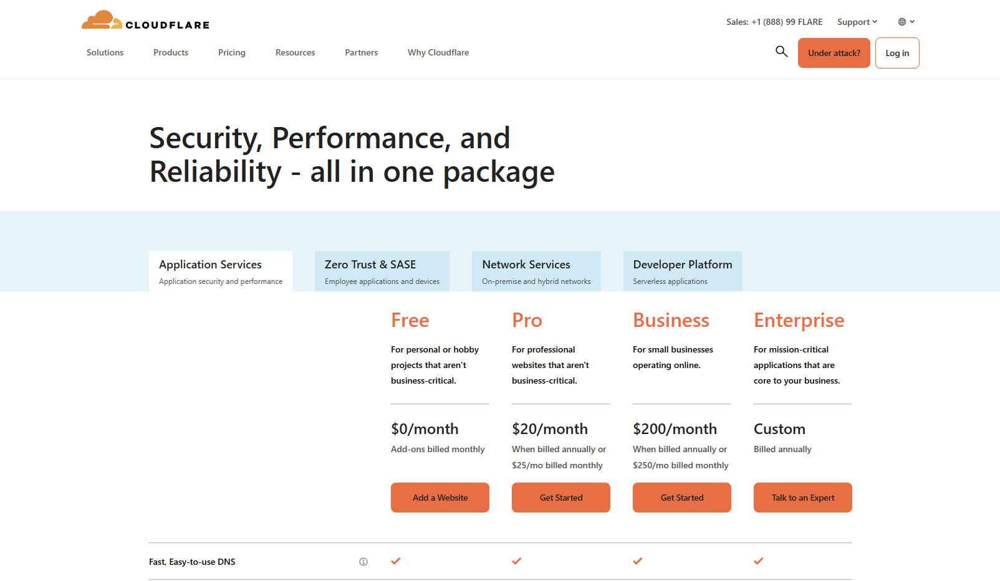
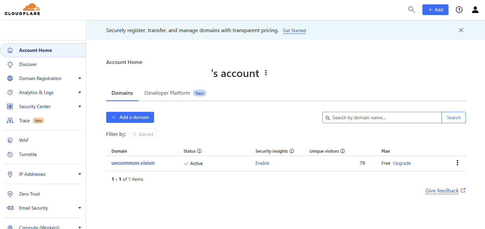
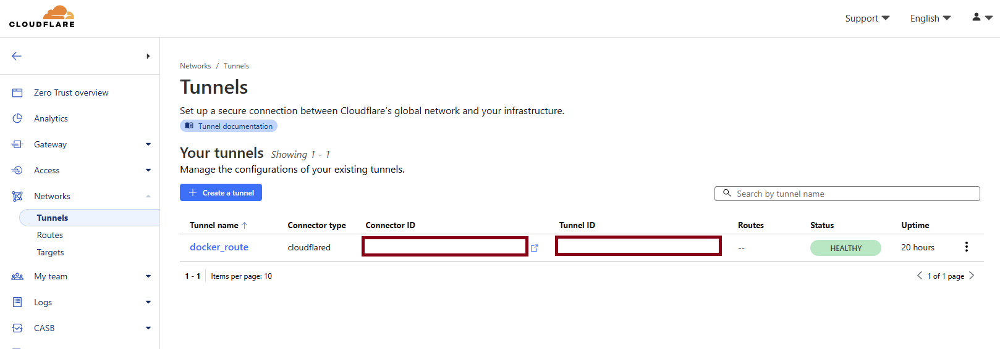
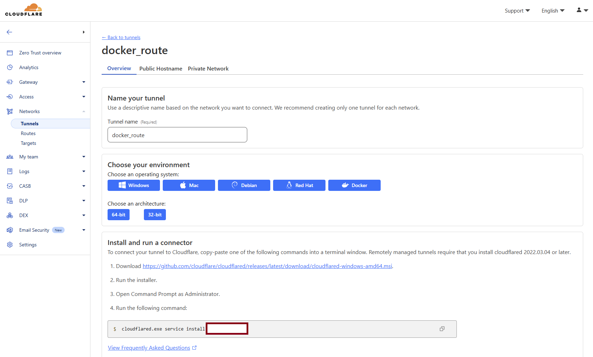

<link rel="stylesheet" href="https://cdnjs.cloudflare.com/ajax/libs/font-awesome/6.0.0-beta3/css/all.min.css">

# Open WebUI Starter
=====================

The Open WebUI Starter project is meant to provide a quick template for 
setting up [Open WebUI](https://openwebui.com/). More information can be found 
about configurations on the [Open WebUI Docs](https://docs.openwebui.com/) or the [Gitub repository](https://github.com/open-webui/open-webui).


## Join others on Discord

If you run into issues, please join the [Open WebUI Starter project discord channel](https://discord.gg/yaER7uvWKD). We will attempt to help!


## 👷Project Overview

The Open WebUI Starter project is a entry into using the open-source project 
Open WebUI. Open WebUI integrates with various Large Language Models (LLMs) and provides a private, user-friendly, and local interface for interacting with computer intelligence.

Here is a link to follow 🔗[project development](https://github.com/users/iamobservable/projects/1) if you so desire.

## Table of Contents
1. [Dependencies](#dependencies)
2. [Tooling and Applications](#tooling-and-applications)
3. [Installation](#installation)
4. [Additional Setup](#additional-setup)
5. [Service Examples](#service-examples)
6. [Contribution](#contribution)

## Dependencies

- **[Git](https://git-scm.com/)**: Version control system for managing code changes
- **[Docker](https://docs.docker.com/)**: Containerization platform for running and deploying applications


## Tooling and Applications

This starter project includes the following tooling and applications. A [Service Architecture Diagram](https://github.com/iamobservable/open-webui-starter/blob/main/docs/service-architecture-diagram.md) is also available that describes how the components of are connected.

- **[Cloudflare](https://www.cloudflare.com/)**: Platform providing anonymous proxying and SSL certificates
- **[Docling](https://github.com/docling-project/docling-serve)**: Simplifies document processing, parsing diverse formats — including advanced PDF understanding — and providing seamless integrations with the gen AI ecosystem. (created by IBM)
- **[Edge TTS](https://github.com/rany2/edge-tts)**: Python module that using Microsoft Edge's online text-to-speech service
- **[MCP Server](https://modelcontextprotocol.io/introduction)**: Open protocol that standardizes how applications provide context to LLMs.
- **[Nginx](https://nginx.org/)**: Web server, reverse proxy, load balancer, mail proxy, and HTTP cache
- **[Ollama](https://ollama.com/)**: Local service API serving open source large language models
- **[Open WebUI](https://openwebui.com/)**: Open WebUI is an extensible, feature-rich, and user-friendly self-hosted AI platform designed to operate entirely offline
- **[Postgresql](https://www.postgresql.org/)/[PgVector](https://github.com/pgvector/pgvector)**: A free and open-source relational database management system (RDBMS) emphasizing extensibility and SQL compliance (has vector addon)
- **[Redis](https://redis.io/)**: An open source-available, in-memory storage, used as a distributed, in-memory key–value database, cache and message broker, with optional durability
- **[Searxng](https://docs.searxng.org/)**: Free internet metasearch engine for open webui tool integration
- **[Sqlite](https://www.sqlite.org/index.html)**: A C-language library that implements a small, fast, self-contained, high-reliability, full-featured, SQL database engine
- **[Tika](https://tika.apache.org/)**: A toolkit that detects and extracts metadata and text from over a thousand different file types
- **[Watchtower](https://github.com/containrrr/watchtower)**: Automated Docker container for updating container images automatically


## Installation

To install the Open WebUI Starter project, follow these steps:

### Clone this repository

```sh
git clone https://github.com/iamobservable/open-webui-starter.git
```

### Create the docker compose and environment files

```sh
cp compose.yml.example compose.yml

cp conf/cloudflare/config.example conf/cloudflare/config.yml
cp conf/mcposerver/config.example conf/mcposerver/config.json
cp conf/nginx/nginx.example conf/nginx/nginx.conf
cp conf/nginx/conf.d/default.example conf/nginx/conf.d/default.conf
cp conf/searxng/settings.yml.example conf/searxng/settings.yml
cp conf/searxng/uwsgi.ini.example conf/searxng/uwsgi.ini

cp env/auth.example env/auth.env
cp env/cloudflared.example env/cloudflared.env
cp env/db.example env/db.env
cp env/docling.example env/docling.env
cp env/edgetts.example env/edgetts.env
cp env/ollama.example env/ollama.env
cp env/mcposerver.example env/mcposerver.env
cp env/openwebui.example env/openwebui.env
cp env/redis.example env/redis.env
cp env/searxng.example env/searxng.env
cp env/tika.example env/tika.env
cp env/watchtower.example env/watchtower.env
```

*The environment files can contain sensitive information such as API keys 
and passwords. Do not check them into source control.*

### Add a unique SEARXNG_SECRET

Make this change to your searxng environment file [env/searxng.env](http://github.com/iamobservable/open-webui-starter/blob/main/env/searxng.example#L3). The link provided will lead you to the github repository to read about it.

### Update and uncomment SEARXNG_BASE_URL

Update the [env/searxng.env](http://github.com/iamobservable/open-webui-starter/blob/main/env/searxng.example#L4) with the domain name you will be using and uncomment the line by removing the # from the beginning. The link provided will lead you to the github repository to read about it.

### Add a unique WEBUI_SECRET_KEY to your environment files

Make this change to your auth environment file [env/auth.env](http://github.com/iamobservable/open-webui-starter/blob/main/env/auth.example#L2). The link provided will lead you to the github repository to read about it.

Make this change to your openwebui environment file [env/openwebui.env](http://github.com/iamobservable/open-webui-starter/blob/main/env/openwebui.example#L38).

**Make sure the environment files match**:. This allows jwt token authentication to work with the main Open WebUI (/), swagger (/docs), redis (/redis), and searxng (/searxng)

### Add your domain name as WEBUI_URL to your environment files

Make this change to your openwebui environment file [env/openwebui.env](http://github.com/iamobservable/open-webui-starter/blob/main/env/openwebui.example#L39).

### Setup Cloudflare

Cloudflare provides a way to point web browsers to a domain name that connects to your local Open WebUI environment. The platform will also setup and provide a free certificate so you can secure your domain name with SSL.

 **Beware**

One additional point about moving forward without using a proxying platform like Cloudflare. With the right tools, IP addresses can be mapped to a physical location in the real world. If you connect a domain name to your home IP without the use of a proxying platform, it is possible to [DOX](https://en.wikipedia.org/wiki/Doxing) the location. *It is in your best interest to use a proxy, thus anonymizing the location.*

#### Sign up with a [free account](https://www.cloudflare.com/plans/)

Get started using Cloudflare.



#### Add a domain for Cloudflare to manage

This allows Cloudflare to receive visitors when they look up your domain in a browser.



#### Configure a Zero Trust Network tunnel

This allows Cloudflare to send visitors to your connected environment (home or otherwise)




### Assign your tunnel id

Update your [conf/cloudflared/config.yml line #1](https://github.com/iamobservable/open-webui-starter/blob/main/conf/cloudflare/config.example#L1) and [conf/cloudflared/config.yml line #2](https://github.com/iamobservable/open-webui-starter/blob/main/conf/cloudflare/config.example#L2) with your tunnel id. It can be found located in one of the two red rectangles on the image above.

### Assign your tunnel token

Update the [env/cloudflared.env](http://github.com/iamobservable/open-webui-starter/blob/main/env/cloudflared.example#L1) file with your token. It can be found in the red rectangle on the image below.



### Add your domain name

Update the [conf/nginx/conf.d/default.conf](https://github.com/iamobservable/open-webui-starter/blob/main/conf/nginx/conf.d/default.example#L24) file with your domain name. The link provided will show you the specific line in the file to change.

### Start your docker container environment from a terminal

You are ready to start up the containers. Let's do it!

```sh
docker compose up -d
```

### Download your first Ollama model from a terminal

You are ready to download an LLM for Ollama. Llama3.2:3b is listed below, but feel free to change this to any model you feel is right. [More on Ollama models](https://ollama.com/search)

```sh
docker compose exec ollama bash

ollama pull llama3.2:3b
```

Once the containers are started, and your model downloaded, you are ready to access the Open WebUI platform. Visit 
`http://<domain-name>/` in your web browser.


## Additional Setup

### MCP Servers

Model Context Protocol (MCP) is a configurable set of tools, resources, prompts, samplings, and roots. They provide 
a structured way to expose local functionality to the LLM. Examples are providing access to the local file system, 
searching the internet, interacting with git or github, and much more.

#### Manual entry (MUST COMPLETE)

The configuration for tools currently requires a manual step to complete. This is due my own lack of understanding of how 
the environment variable TOOL_SERVER_CONNECTIONS is used in [env/openwebui.env](http://github.com/iamobservable/open-webui-starter/blob/main/env/openwebui.example#L34). 
If anyone has a good understanding, and has been able to see it work in practice, please share a [pull request](https://github.com/iamobservable/open-webui-starter/pulls) or 
message me [directly on Discord](https://discordapp.com/users/observable).

For now, to use the two default tools, it is required to add them manually. **They will NOT** automatically load using the environment variable TOOL_SERVER_CONNECTIONS, enen 
though it is added. Add the following two urls using the Settings -> Tools -> General interface. This can also be set in the Admin Settings as well.

*Note - the default postgres tool is configured to access your Open WebUI postgres database. While this is read-only, the tool server that is defined allows any user with 
the credentials added to the [env/mcposerver.env](http://github.com/iamobservable/open-webui-starter/blob/main/conf/mcposerver/config.example#L12) to access the database tables. If 
anything should be restricted, make sure to do so ahead of time.*


```clipboard
http://mcposerver:8000/time
```
```clipboard
http://mcposerver:8000/postgres
```


#### Initial configuration

Configurations for MCP services can be found in the [conf/mcposerver/config.json](https://github.com/iamobservable/open-webui-starter/blob/main/conf/mcposerver/config.example) file. Links below in the table describe the initially configuration.

***Note - the time tool is configured using uvx instead of directly with the python binary, as the repository describes*** 

You may expand on the tools available to your interface. A few examples are listed below.

| Tool                                                                               | Description                                                               | Configuration |
| ---------------------------------------------------------------------------------- | ------------------------------------------------------------------------- | ------------- |
| [time](https://github.com/modelcontextprotocol/servers/tree/main/src/time)         | Provides current time values for [configured timezone](https://github.com/iamobservable/open-webui-starter/blob/main/conf/mcposerver/config.example#L5)                      | [config/mcposerver/config.json](https://github.com/iamobservable/open-webui-starter/blob/main/conf/mcposerver/config.example#L3) |
| [postgres](https://github.com/modelcontextprotocol/servers/tree/main/src/postgres) | Provides sql querying for the configured database (defaults to openwebui) | [config/mcposerver/config.json](https://github.com/iamobservable/open-webui-starter/blob/main/conf/mcposerver/config.example#L7) |

#### MCP Server Discovery

If you are looking for tools to add, the following three MCP Server sources are a great place to look. It may even inspire you to create your own over time!

- [Model Context Protocol servers](https://github.com/modelcontextprotocol/servers?tab=readme-ov-file#model-context-protocol-servers)
- [Awesome MCP Servers](https://mcpservers.org/)
- [Smithery](https://smithery.ai/)

### Watchtower and Notifications

A Watchtower container provides a convenient way to check in on your container 
versions to see if updates have been released. Once updates are found, Watchtower 
will pull the latest container image(s), stop the currently running container and 
start a new container based on the new image. **And it is all automatic, look no hands!**

After completing its process, 
Watchtower can send notifications to you. More can be found on notifications via 
the [Watchtower website](https://containrrr.dev/watchtower/notifications/).

For the sake of simplicity, this document will cover the instructions for setting 
up notifications via Discord. If you desire to be more detailed in your configuration, 
the [arguments section](https://containrrr.dev/watchtower/arguments/) describes 
additional settings available for the watchtower setup.

1. Edit your [env/watchtower.env](https://github.com/iamobservable/open-webui-starter/blob/main/env/watchtower.example#L2) with your discord link. [More information](https://containrrr.dev/shoutrrr/v0.8/services/discord/) is provided on how to create your discord link (token@webhookid).
2. Restart your watchtower container

```bash
docker compose down watchtower && docker compose up watchtower -d
```

### Migrating from Sqlite to Postgresql

**Please note, the starter project does not use Sqlite for storage. Postgresql has been configured by default.**

For installations where the 
environment was already setup to use Sqlite, please refer to 
[Taylor Wilsdon](https://github.com/taylorwilsdon)'s github repository 
[open-webui-postgres-migration](https://github.com/taylorwilsdon/open-webui-postgres-migration). 
In it, he provides a migration tool for converting between the two databases.


## Service Examples

This section is to show how services within docker compose infra can be used 
directly or programmatically without the Open WebUI interface. The examples 
have been created as *.sh scripts that can be executed via the command line.


### Docling

**PDF document to markdown**

Generates a JSON document with the markdown text included. Changes to the config.json document, located in the same directory, can change how Docling responds. More information on how to configure Docling can be found in the [Advance usage section](https://github.com/docling-project/docling-serve/blob/main/docs/usage.md) of the [Docling Serve documentation](https://github.com/docling-project/docling-serve/blob/main/docs/README.md).

```sh
curl -X POST "http://localhost:5001/v1alpha/convert/source" \
    -H "accept: application/json" \
    -H "Content-Type: application/json" \
    -d '{
      "options": {
        "do_picture_description": false,
        "image_export_mode": "embedded",
        "images_scale": 2.0,
        "include_images": false,
        "return_as_file": false,
        "to_formats": ["md"]
      },
      "http_sources": [{ "url": "https://arxiv.org/pdf/2408.09869" }]
    }'
```


### Edgetts

EdgeTTS is a service integration that uses Microsoft's online text-to-speech 
service. Keep in mind, if you want to be completely local, this service is not 
for you.

*More information about [available voice samples](https://tts.travisvn.com/) 
the [EdgeTTS codebase and configuration](https://github.com/travisvn/openai-edge-tts)*.

**Speech in Spanish**

Generate Spanish speech from a speaker with a Spanish accent.

```sh
curl -X POST "http://localhost:5050/v1/audio/speech" \
    -H "Content-Type: application/json" \
    -H "Authorization: Bearer your_api_key_here" \
    -d '{
      "input": "Hola! Mi nombre es Alonso",
      "response_format": "mp3",
      "speed": 1,
      "stream": true,
      "voice": "es-US-AlonsoNeural",
      "model": "tts-1-hd"
    }' > alonso-es-hola.mp3
```

**Speech in English**

Generates English speech from a speaker with an English accent.

```sh
curl -X POST "http://localhost:5050/v1/audio/speech" \
    -H "Content-Type: application/json" \
    -H "Authorization: Bearer your_api_key_here" \
    -d '{
      "input": "Hi, my name is Wayland. This is an audio example.",
      "response_format": "mp3",
      "speed": 1,
      "stream": true,
      "voice": "en-US-AndrewMultilingualNeural",
      "model": "tts-1-hd"
    }' > wayland-intro.mp3
```


### Tika

**Information about the PDF document**

Generates meta data from a provided url. More information can be found via the [Metadata Resource documentation](https://cwiki.apache.org/confluence/pages/viewpage.action?pageId=148639291#TikaServer-MetadataResource)

```sh
curl https://arxiv.org/abs/2408.09869v5 > 2408.09869v5.pdf
curl http://localhost:9998/meta \
    -H "Accept: application/json" -T 2408.09869v5.pdf 
```

**PDF document (url) to HTML**

Generates HTML from a provided url. More information can be found via the [Tika Resource Documentation](https://cwiki.apache.org/confluence/pages/viewpage.action?pageId=148639291#TikaServer-GettheTextofaDocument)

```sh
curl https://arxiv.org/abs/2408.09869v5 > 2408.09869v5.pdf
curl http://localhost:9998/tika \
    -H "Accept: text/html" -T 2408.09869v5.pdf 
```

**PDF document (url) to plain text**

Generates plain text from a provided url. More information can be found via the [Tika Resource Documentation](https://cwiki.apache.org/confluence/pages/viewpage.action?pageId=148639291#TikaServer-GettheTextofaDocument)

```sh
curl https://arxiv.org/abs/2408.09869v5 > 2408.09869v5.pdf
curl http://localhost:9998/tika \
    -H "Accept: text/plain" -T 2408.09869v5.pdf 
```


## Contribution

Contributions to the Open WebUI Starter project are welcome and encouraged! If you'd like to 
contribute, please fork this repository and submit a [pull request](https://github.com/iamobservable/open-webui-starter/pulls) with any 
suggested changes or additions.

