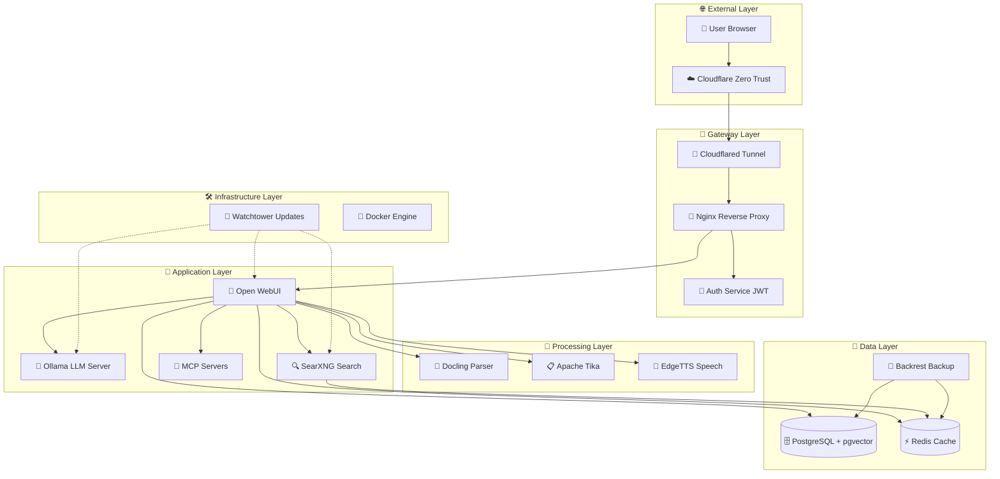

# 🏗️ Архитектура системы ERNI-KI

> **Версия документа:** 3.0
> **Дата обновления:** 2025-07-15
> **Статус:** Production Ready

## 📋 Обзор архитектуры

ERNI-KI представляет собой современную микросервисную AI платформу, построенную на принципах контейнеризации, безопасности и масштабируемости. Система состоит из **16 взаимосвязанных сервисов**, включая новые компоненты LiteLLM, Docling и Context Engineering, каждый из которых выполняет специализированную функцию.

## 🎯 Архитектурные принципы

### 🔒 **Security First**
- JWT аутентификация для всех API запросов
- Rate limiting и защита от DDoS атак
- SSL/TLS шифрование всего трафика
- Изоляция сервисов через Docker networks

### 📈 **Scalability & Performance**
- Горизонтальное масштабирование через Docker Compose
- GPU ускорение для AI вычислений
- Кэширование через Redis
- Асинхронная обработка документов

### 🛡️ **Reliability & Monitoring**
- Health checks для всех сервисов
- Автоматические перезапуски при сбоях
- Централизованное логирование
- Автоматические резервные копии

## 🏛️ Диаграмма высокого уровня

## 🔧 Детальная архитектура сервисов

### 🚪 **Gateway Layer (Шлюз)**

#### Nginx Reverse Proxy
- **Назначение**: Единая точка входа, балансировка нагрузки, SSL терминация
- **Порты**: 80 (HTTP), 443 (HTTPS), 8080 (Internal)
- **Функции**:
  - Rate limiting (100 req/min для общих запросов, 10 req/min для SearXNG)
  - SSL/TLS терминация с современными cipher suites
  - Проксирование WebSocket соединений
  - Статическая раздача файлов
  - Кэширование статического контента

#### Auth Service (JWT)
- **Технология**: Go 1.23+
- **Порт**: 9090
- **Функции**:
  - Генерация и валидация JWT токенов
  - Интеграция с nginx auth_request
  - Управление сессиями пользователей
  - Rate limiting для аутентификации

#### Cloudflared Tunnel
- **Назначение**: Безопасное подключение к Cloudflare Zero Trust
- **Функции**:
  - Шифрованные туннели без открытых портов
  - Автоматическое управление SSL сертификатами
  - DDoS защита на уровне Cloudflare
  - Географическое распределение трафика

### 🤖 **Application Layer (Приложения)**

#### Open WebUI
- **Технология**: Python FastAPI + Svelte
- **Порт**: 8080
- **GPU**: NVIDIA CUDA поддержка
- **Функции**:
  - Веб-интерфейс для работы с AI моделями
  - RAG (Retrieval-Augmented Generation) поиск
  - Управление чатами и историей
  - Интеграция с внешними сервисами
  - Загрузка и обработка документов
  - Голосовой ввод/вывод

#### Ollama LLM Server
- **Технология**: Go + CUDA
- **Порт**: 11434
- **GPU**: Полная поддержка NVIDIA GPU
- **Функции**:
  - Локальный запуск языковых моделей
  - Автоматическое управление GPU памятью
  - API совместимый с OpenAI
  - Поддержка множественных моделей
  - Streaming ответы

#### SearXNG Search Engine
- **Технология**: Python Flask
- **Порт**: 8080 (internal)
- **Функции**:
  - Метапоисковый движок (Google, Bing, DuckDuckGo)
  - Приватный поиск без трекинга
  - JSON API для интеграции с RAG
  - Кэширование результатов в Redis
  - Rate limiting и защита от блокировок

#### LiteLLM Proxy
- **Технология**: Python FastAPI
- **Порт**: 4000
- **Функции**:
  - Унифицированный API для различных LLM провайдеров
  - Поддержка OpenAI, Anthropic, Google, Azure
  - Балансировка нагрузки между моделями
  - Мониторинг использования и затрат
  - Кэширование ответов
  - Rate limiting и квоты

#### MCP Servers (Context Engineering)
- **Технология**: Model Context Protocol
- **Порт**: 8000
- **Функции**:
  - Расширение возможностей AI через инструменты
  - Интеграция с внешними API и сервисами
  - Выполнение кода и команд
  - Доступ к базам данных и файловым системам
  - Context Engineering для улучшения AI ответов

### 🔧 **Processing Layer (Обработка)**

#### Docling Document Parser
- **Технология**: Python + AI models
- **Порт**: 5001
- **Функции**:
  - Извлечение текста из PDF, DOCX, PPTX
  - OCR для сканированных документов
  - Структурный анализ документов
  - Поддержка таблиц и изображений

#### Apache Tika
- **Технология**: Java
- **Порт**: 9998
- **Функции**:
  - Извлечение метаданных из файлов
  - Поддержка 1000+ форматов файлов
  - Детекция типов файлов
  - Извлечение текста и структуры

#### EdgeTTS Speech Synthesis
- **Технология**: Python + Microsoft Edge TTS
- **Порт**: 5050
- **Функции**:
  - Высококачественный синтез речи
  - Поддержка множественных языков и голосов
  - Streaming аудио
  - Интеграция с Open WebUI

### 💾 **Data Layer (Данные)**

#### PostgreSQL + pgvector
- **Версия**: PostgreSQL 16 + pgvector extension
- **Порт**: 5432
- **Функции**:
  - Основная база данных приложения
  - Векторное хранилище для RAG
  - Полнотекстовый поиск
  - ACID транзакции
  - Репликация и бэкапы

#### Redis Cache
- **Версия**: Redis Stack (Redis + RedisInsight)
- **Порты**: 6379 (Redis), 8001 (RedisInsight)
- **Функции**:
  - Кэширование поисковых запросов
  - Сессии пользователей
  - Очереди задач
  - Pub/Sub для real-time уведомлений

#### Backrest Backup System
- **Технология**: Go + Restic
- **Порт**: 9898
- **Функции**:
  - Автоматические инкрементальные бэкапы
  - Шифрование данных
  - Дедупликация
  - Веб-интерфейс управления
  - Восстановление на определенную дату

### 🛠️ **Infrastructure Layer (Инфраструктура)**

#### Watchtower Auto-updater
- **Функции**:
  - Автоматическое обновление Docker образов
  - Мониторинг новых версий
  - Graceful перезапуск сервисов
  - Уведомления об обновлениях

## 🌐 Сетевая архитектура

### Порты и протоколы

| Сервис | Внешний порт | Внутренний порт | Протокол | Назначение |
|--------|--------------|-----------------|----------|------------|
| nginx | 80, 443, 8080 | 80, 443, 8080 | HTTP/HTTPS | Web gateway |
| auth | - | 9090 | HTTP | JWT validation |
| openwebui | - | 8080 | HTTP/WS | AI interface |
| ollama | - | 11434 | HTTP | LLM API |
| litellm | 4000 | 4000 | HTTP | LLM proxy |
| db | - | 5432 | PostgreSQL | Database |
| redis | - | 6379, 8001 | Redis/HTTP | Cache & UI |
| searxng | - | 8080 | HTTP | Search API |
| mcposerver | - | 8000 | HTTP | MCP protocol |
| docling | - | 5001 | HTTP | Document parsing |
| tika | - | 9998 | HTTP | Metadata extraction |
| edgetts | - | 5050 | HTTP | Speech synthesis |
| backrest | 9898 | 9898 | HTTP | Backup management |
| cloudflared | - | - | HTTPS | Tunnel service |
| watchtower | - | - | - | Auto-updater |

### Docker Networks
- **erni-ki_default**: Основная сеть для всех сервисов
- **Изоляция**: Каждый сервис доступен только по имени контейнера
- **DNS**: Автоматическое разрешение имен через Docker DNS

## 🔄 Потоки данных

### Пользовательский запрос
1. **Browser** → **Cloudflare** → **Cloudflared** → **Nginx**
2. **Nginx** → **Auth Service** (валидация JWT)
3. **Nginx** → **Open WebUI** (основной интерфейс)
4. **Open WebUI** → **Ollama** (генерация ответа)
5. **Open WebUI** → **PostgreSQL** (сохранение истории)

### RAG поиск
1. **Open WebUI** → **SearXNG** (поиск информации)
2. **SearXNG** → **Redis** (кэширование результатов)
3. **Open WebUI** → **PostgreSQL/pgvector** (векторный поиск)
4. **Open WebUI** → **Ollama** (генерация с контекстом)

### Обработка документов
1. **Open WebUI** → **Docling/Tika** (парсинг документа)
2. **Open WebUI** → **PostgreSQL/pgvector** (сохранение векторов)
3. **Open WebUI** → **Ollama** (анализ содержимого)

## 📊 Мониторинг и наблюдаемость

### Health Checks
- Все сервисы имеют настроенные health checks
- Автоматический перезапуск при сбоях
- Мониторинг через `docker compose ps`

### Логирование
- Централизованные логи через Docker logging driver
- Ротация логов для предотвращения переполнения диска
- Структурированное логирование в JSON формате

### Метрики
- Использование ресурсов через `docker stats`
- Мониторинг GPU через nvidia-smi
- Производительность базы данных

## 🔧 Конфигурация и развертывание

### Переменные окружения
- Каждый сервис имеет отдельный `.env` файл
- Секретные ключи генерируются автоматически
- Конфигурация через Docker Compose

### Масштабирование
- Горизонтальное масштабирование через Docker Compose scale
- Балансировка нагрузки через Nginx upstream
- Автоматическое обнаружение новых экземпляров

### Безопасность
- Минимальные привилегии для всех контейнеров
- Изоляция сетей и файловых систем
- Регулярные обновления безопасности через Watchtower

---

**📝 Примечание**: Данная архитектура оптимизирована для production использования с акцентом на безопасность, производительность и надежность.
