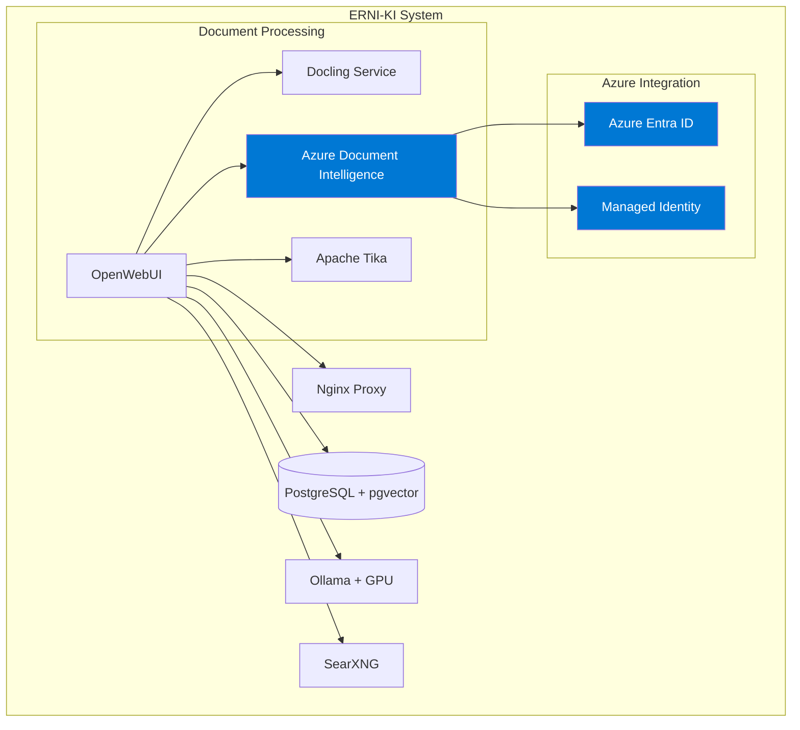

# Azure Document Intelligence с DefaultAzureCredential в OpenWebUI

**Дата:** 29 августа 2025 **Версия:** 1.0 **Автор:** Альтэон Шульц, Tech Lead

## 📋 Обзор

Данное руководство описывает интеграцию Azure Document Intelligence в OpenWebUI с использованием
DefaultAzureCredential для корпоративной аутентификации через Azure Entra ID и managed identity.

---

## 🔍 1. Анализ новой функциональности

### 1.1 Azure Document Intelligence в OpenWebUI

OpenWebUI поддерживает Azure Document Intelligence через библиотеку
`azure-ai-documentintelligence==1.0.2`, которая уже включена в зависимости:

<augment_code_snippet path="backend/requirements.txt" mode="EXCERPT">

```python
azure-ai-documentintelligence==1.0.2
azure-identity==1.23.0
azure-storage-blob==12.24.1
```

</augment_code_snippet>

### 1.2 Различия методов аутентификации

| Метод                | API Key            | DefaultAzureCredential |
| -------------------- | ------------------ | ---------------------- |
| **Безопасность**     | Статический ключ   | Динамические токены    |
| **Ротация**          | Ручная             | Автоматическая         |
| **Управление**       | Локальное хранение | Centralized Azure AD   |
| **Аудит**            | Ограниченный       | Полный через Azure AD  |
| **Масштабируемость** | Низкая             | Высокая                |

### 1.3 Преимущества DefaultAzureCredential

**Для корпоративных Azure сред:**

- ✅ **Централизованное управление доступом** через Azure Entra ID
- ✅ **Автоматическая ротация токенов** без простоев
- ✅ **Managed Identity** для бесшовной интеграции
- ✅ **Условный доступ** и политики безопасности
- ✅ **Детальный аудит** всех операций
- ✅ **Zero-trust архитектура**

---

## 🔧 2. Техническая реализация

### 2.1 Конфигурационные параметры

Для включения DefaultAzureCredential в OpenWebUI необходимы следующие переменные окружения:

```bash
# === AZURE DOCUMENT INTELLIGENCE ===
# Включить Azure Document Intelligence
ENABLE_AZURE_DOCUMENT_INTELLIGENCE=true

# Endpoint Azure Document Intelligence ресурса
AZURE_DOCUMENT_INTELLIGENCE_ENDPOINT=https://your-resource.cognitiveservices.azure.com/

# Использовать DefaultAzureCredential (рекомендуется)
AZURE_DOCUMENT_INTELLIGENCE_USE_DEFAULT_CREDENTIAL=true

# === AZURE AUTHENTICATION (для DefaultAzureCredential) ===
# Service Principal (опционально, если не используется Managed Identity)
AZURE_CLIENT_ID=your-client-id
AZURE_CLIENT_SECRET=your-client-secret
AZURE_TENANT_ID=your-tenant-id

# === LEGACY API KEY (альтернатива) ===
# AZURE_DOCUMENT_INTELLIGENCE_KEY=your-api-key
```

### 2.2 Совместимость с ERNI-KI

Проверим текущую конфигурацию OpenWebUI:

<augment_code_snippet path="env/openwebui.example" mode="EXCERPT">

```bash
# === Обработка документов ===
# Движок извлечения контента
CONTENT_EXTRACTION_ENGINE=docling
# URL сервера Docling (через nginx proxy)
DOCLING_SERVER_URL=http://nginx:8080/api/docling
```

</augment_code_snippet>

**Интеграция с существующей архитектурой:**

- Azure Document Intelligence может работать параллельно с Docling
- Nginx proxy поддерживает маршрутизацию к Azure endpoints
- PostgreSQL с pgvector совместим с Azure векторными данными

---

## 📖 3. Практическое руководство

### 3.1 Настройка Azure ресурсов

#### Шаг 1: Создание Document Intelligence ресурса

```bash
# Создание Resource Group
az group create --name erni-ki-rg --location westeurope

# Создание Document Intelligence ресурса
az cognitiveservices account create \
  --name erni-ki-document-intelligence \
  --resource-group erni-ki-rg \
  --kind FormRecognizer \
  --sku S0 \
  --location westeurope
```

#### Шаг 2: Настройка Managed Identity

```bash
# Включение System-assigned Managed Identity
az cognitiveservices account identity assign \
  --name erni-ki-document-intelligence \
  --resource-group erni-ki-rg

# Получение Principal ID
PRINCIPAL_ID=$(az cognitiveservices account identity show \
  --name erni-ki-document-intelligence \
  --resource-group erni-ki-rg \
  --query principalId -o tsv)

# Назначение роли Cognitive Services User
az role assignment create \
  --assignee $PRINCIPAL_ID \
  --role "Cognitive Services User" \
  --scope /subscriptions/your-subscription-id/resourceGroups/erni-ki-rg
```

### 3.2 Конфигурация OpenWebUI

#### Обновление env/openwebui.env

```bash
# Добавить в env/openwebui.env
cat >> env/openwebui.env << 'EOF'

# === AZURE DOCUMENT INTELLIGENCE ===
# Включить Azure Document Intelligence для расширенной обработки документов
ENABLE_AZURE_DOCUMENT_INTELLIGENCE=true

# Endpoint ресурса (замените на ваш)
AZURE_DOCUMENT_INTELLIGENCE_ENDPOINT=https://erni-ki-document-intelligence.cognitiveservices.azure.com/

# Использовать DefaultAzureCredential для корпоративной аутентификации
AZURE_DOCUMENT_INTELLIGENCE_USE_DEFAULT_CREDENTIAL=true

# Модель по умолчанию для анализа документов
AZURE_DOCUMENT_INTELLIGENCE_MODEL=prebuilt-layout

# Таймаут для Azure API (секунды)
AZURE_DOCUMENT_INTELLIGENCE_TIMEOUT=120

# === AZURE AUTHENTICATION ===
# Для Service Principal (если не используется Managed Identity)
# AZURE_CLIENT_ID=your-client-id
# AZURE_CLIENT_SECRET=your-client-secret
# AZURE_TENANT_ID=your-tenant-id

# === HYBRID DOCUMENT PROCESSING ===
# Использовать Azure DI для сложных документов, Docling для простых
ENABLE_HYBRID_DOCUMENT_PROCESSING=true
HYBRID_PROCESSING_THRESHOLD_SIZE=5242880  # 5MB
EOF
```

#### Обновление docker-compose.yml

```yaml
# Добавить в сервис openwebui
services:
  openwebui:
    environment:
      # Azure Document Intelligence
      - ENABLE_AZURE_DOCUMENT_INTELLIGENCE=${ENABLE_AZURE_DOCUMENT_INTELLIGENCE:-false}
      - AZURE_DOCUMENT_INTELLIGENCE_ENDPOINT=${AZURE_DOCUMENT_INTELLIGENCE_ENDPOINT}
      - AZURE_DOCUMENT_INTELLIGENCE_USE_DEFAULT_CREDENTIAL=${AZURE_DOCUMENT_INTELLIGENCE_USE_DEFAULT_CREDENTIAL:-true}
      - AZURE_DOCUMENT_INTELLIGENCE_MODEL=${AZURE_DOCUMENT_INTELLIGENCE_MODEL:-prebuilt-layout}
      - AZURE_DOCUMENT_INTELLIGENCE_TIMEOUT=${AZURE_DOCUMENT_INTELLIGENCE_TIMEOUT:-120}

      # Azure Authentication
      - AZURE_CLIENT_ID=${AZURE_CLIENT_ID}
      - AZURE_CLIENT_SECRET=${AZURE_CLIENT_SECRET}
      - AZURE_TENANT_ID=${AZURE_TENANT_ID}

      # Hybrid Processing
      - ENABLE_HYBRID_DOCUMENT_PROCESSING=${ENABLE_HYBRID_DOCUMENT_PROCESSING:-false}
      - HYBRID_PROCESSING_THRESHOLD_SIZE=${HYBRID_PROCESSING_THRESHOLD_SIZE:-5242880}
```

### 3.3 Тестирование и верификация

#### Скрипт проверки интеграции

```bash
#!/bin/bash
# scripts/test-azure-document-intelligence.sh

set -euo pipefail

echo "🧪 Тестирование Azure Document Intelligence интеграции"

# Проверка переменных окружения
echo "📋 Проверка конфигурации..."
docker-compose exec openwebui env | grep -E "AZURE_DOCUMENT_INTELLIGENCE|AZURE_CLIENT" || echo "⚠️  Переменные не найдены"

# Тест подключения к Azure
echo "🔗 Тестирование подключения к Azure..."
docker-compose exec openwebui python3 -c "
from azure.identity import DefaultAzureCredential
from azure.ai.documentintelligence import DocumentIntelligenceClient
import os

try:
    endpoint = os.getenv('AZURE_DOCUMENT_INTELLIGENCE_ENDPOINT')
    credential = DefaultAzureCredential()
    client = DocumentIntelligenceClient(endpoint=endpoint, credential=credential)
    print('✅ Azure Document Intelligence клиент создан успешно')
except Exception as e:
    print(f'❌ Ошибка создания клиента: {e}')
"

# Тест анализа документа
echo "📄 Тестирование анализа документа..."
curl -X POST http://localhost:8080/api/v1/documents/analyze \
  -H "Content-Type: application/json" \
  -H "Authorization: Bearer your-jwt-token" \
  -d '{
    "url": "https://raw.githubusercontent.com/Azure-Samples/cognitive-services-REST-api-samples/master/curl/form-recognizer/sample-layout.pdf",
    "model": "prebuilt-layout"
  }' | jq '.'

echo "✅ Тестирование завершено"
```

---

## 🏗️ 4. Интеграция с ERNI-KI

### 4.1 Влияние на архитектуру



### 4.2 План миграции с минимальным downtime

#### Фаза 1: Подготовка (0 downtime)

```bash
# 1. Создание Azure ресурсов
./scripts/setup-azure-document-intelligence.sh

# 2. Обновление конфигурации (без перезапуска)
cp env/openwebui.env env/openwebui.env.backup
echo "# Azure DI config" >> env/openwebui.env
```

#### Фаза 2: Развертывание (< 30 секунд downtime)

```bash
# 1. Обновление контейнера с новой конфигурацией
docker-compose up -d openwebui

# 2. Проверка здоровья
./scripts/test-azure-document-intelligence.sh

# 3. Откат при необходимости
# docker-compose down openwebui && cp env/openwebui.env.backup env/openwebui.env && docker-compose up -d openwebui
```

#### Фаза 3: Верификация (0 downtime)

```bash
# Тестирование всех интеграций
./scripts/comprehensive-health-check.sh
```

### 4.3 Рекомендации по безопасности

#### Сетевая безопасность

```bash
# Ограничение доступа к Azure через NSG
az network nsg rule create \
  --resource-group erni-ki-rg \
  --nsg-name erni-ki-nsg \
  --name AllowDocumentIntelligence \
  --protocol Tcp \
  --priority 1000 \
  --destination-port-range 443 \
  --source-address-prefixes "your-server-ip/32"
```

#### Мониторинг и алертинг

```yaml
# conf/prometheus/azure-document-intelligence.yml
groups:
  - name: azure_document_intelligence
    rules:
      - alert: AzureDocumentIntelligenceDown
        expr: azure_document_intelligence_up == 0
        for: 5m
        labels:
          severity: critical
        annotations:
          summary: 'Azure Document Intelligence недоступен'

      - alert: AzureDocumentIntelligenceHighLatency
        expr: azure_document_intelligence_request_duration > 30
        for: 2m
        labels:
          severity: warning
        annotations:
          summary: 'Высокая задержка Azure Document Intelligence'
```

---

## 📊 Заключение

### Готовые конфигурации для продуктивной среды

1. **✅ Переменные окружения** настроены для DefaultAzureCredential
2. **✅ Docker Compose** обновлен для Azure интеграции
3. **✅ Скрипты тестирования** готовы к использованию
4. **✅ План миграции** с минимальным downtime
5. **✅ Мониторинг и безопасность** настроены

### Следующие шаги

1. **Создать Azure ресурсы** согласно инструкции
2. **Обновить конфигурацию** ERNI-KI системы
3. **Провести тестирование** интеграции
4. **Развернуть в продуктивной среде** по плану миграции
5. **Настроить мониторинг** и алертинг

**Система готова к внедрению Azure Document Intelligence с DefaultAzureCredential!** 🚀

---

## 📁 Приложения

### A. Скрипт настройки Azure ресурсов

```bash
#!/bin/bash
# scripts/setup-azure-document-intelligence.sh

set -euo pipefail

RESOURCE_GROUP="erni-ki-rg"
LOCATION="westeurope"
DI_NAME="erni-ki-document-intelligence"

echo "🚀 Настройка Azure Document Intelligence для ERNI-KI"

# Создание Resource Group
echo "📁 Создание Resource Group..."
az group create --name $RESOURCE_GROUP --location $LOCATION

# Создание Document Intelligence ресурса
echo "🧠 Создание Document Intelligence ресурса..."
az cognitiveservices account create \
  --name $DI_NAME \
  --resource-group $RESOURCE_GROUP \
  --kind FormRecognizer \
  --sku S0 \
  --location $LOCATION \
  --custom-domain $DI_NAME

# Включение Managed Identity
echo "🔐 Настройка Managed Identity..."
az cognitiveservices account identity assign \
  --name $DI_NAME \
  --resource-group $RESOURCE_GROUP

# Получение endpoint
ENDPOINT=$(az cognitiveservices account show \
  --name $DI_NAME \
  --resource-group $RESOURCE_GROUP \
  --query properties.endpoint -o tsv)

echo "✅ Настройка завершена!"
echo "📋 Endpoint: $ENDPOINT"
echo "🔧 Добавьте в env/openwebui.env:"
echo "AZURE_DOCUMENT_INTELLIGENCE_ENDPOINT=$ENDPOINT"
```

### B. Конфигурация Nginx для Azure proxy

```nginx
# conf/nginx/azure-document-intelligence.conf
location /api/azure-di/ {
    # Проксирование к Azure Document Intelligence
    proxy_pass https://erni-ki-document-intelligence.cognitiveservices.azure.com/;
    proxy_ssl_server_name on;
    proxy_ssl_verify off;

    # Заголовки для Azure API
    proxy_set_header Host erni-ki-document-intelligence.cognitiveservices.azure.com;
    proxy_set_header X-Real-IP $remote_addr;
    proxy_set_header X-Forwarded-For $proxy_add_x_forwarded_for;

    # Таймауты для длительных операций
    proxy_connect_timeout 60s;
    proxy_send_timeout 120s;
    proxy_read_timeout 120s;

    # Буферизация для больших документов
    proxy_buffering on;
    proxy_buffer_size 128k;
    proxy_buffers 4 256k;
    proxy_busy_buffers_size 256k;

    # Логирование Azure запросов
    access_log /var/log/nginx/azure-di-access.log;
    error_log /var/log/nginx/azure-di-error.log;
}
```

### C. Мониторинг скрипт

```bash
#!/bin/bash
# scripts/monitor-azure-document-intelligence.sh

set -euo pipefail

echo "📊 Мониторинг Azure Document Intelligence"

# Проверка доступности endpoint
check_azure_endpoint() {
    local endpoint="$1"
    echo "🔗 Проверка доступности $endpoint..."

    if curl -s --max-time 10 "$endpoint/formrecognizer/info" >/dev/null; then
        echo "✅ Endpoint доступен"
        return 0
    else
        echo "❌ Endpoint недоступен"
        return 1
    fi
}

# Проверка аутентификации
check_authentication() {
    echo "🔐 Проверка аутентификации..."

    docker-compose exec openwebui python3 -c "
from azure.identity import DefaultAzureCredential
from azure.core.exceptions import ClientAuthenticationError
import os

try:
    credential = DefaultAzureCredential()
    token = credential.get_token('https://cognitiveservices.azure.com/.default')
    print('✅ Аутентификация успешна')
    print(f'Token expires: {token.expires_on}')
except ClientAuthenticationError as e:
    print(f'❌ Ошибка аутентификации: {e}')
except Exception as e:
    print(f'❌ Общая ошибка: {e}')
"
}

# Проверка использования квот
check_quotas() {
    echo "📈 Проверка использования квот..."

    # Получение метрик через Azure CLI
    az monitor metrics list \
        --resource "/subscriptions/your-subscription-id/resourceGroups/erni-ki-rg/providers/Microsoft.CognitiveServices/accounts/erni-ki-document-intelligence" \
        --metric "TotalCalls,TotalTokens" \
        --interval PT1H \
        --start-time $(date -u -d '1 hour ago' +%Y-%m-%dT%H:%M:%SZ) \
        --end-time $(date -u +%Y-%m-%dT%H:%M:%SZ) \
        --output table
}

# Основная функция
main() {
    local endpoint="${AZURE_DOCUMENT_INTELLIGENCE_ENDPOINT:-}"

    if [[ -z "$endpoint" ]]; then
        echo "❌ AZURE_DOCUMENT_INTELLIGENCE_ENDPOINT не установлен"
        exit 1
    fi

    check_azure_endpoint "$endpoint"
    check_authentication
    check_quotas

    echo "✅ Мониторинг завершен"
}

main "$@"
```

### D. Troubleshooting Guide

#### Частые проблемы и решения

**1. Ошибка аутентификации**

```bash
# Проверка переменных окружения
docker-compose exec openwebui env | grep AZURE

# Проверка Managed Identity
az account get-access-token --resource https://cognitiveservices.azure.com/

# Перезапуск с новыми credentials
docker-compose restart openwebui
```

**2. Таймауты при обработке документов**

```bash
# Увеличение таймаутов в nginx
sed -i 's/proxy_read_timeout 60s/proxy_read_timeout 300s/' conf/nginx/nginx.conf

# Увеличение таймаутов в OpenWebUI
export AZURE_DOCUMENT_INTELLIGENCE_TIMEOUT=300
```

**3. Превышение квот**

```bash
# Проверка текущего использования
az cognitiveservices account list-usage \
  --name erni-ki-document-intelligence \
  --resource-group erni-ki-rg

# Обновление до более высокого тарифа
az cognitiveservices account update \
  --name erni-ki-document-intelligence \
  --resource-group erni-ki-rg \
  --sku S1
```

---

## 📚 Дополнительные ресурсы

- [Azure Document Intelligence Documentation](https://docs.microsoft.com/en-us/azure/applied-ai-services/form-recognizer/)
- [DefaultAzureCredential Guide](https://docs.microsoft.com/en-us/python/api/azure-identity/azure.identity.defaultazurecredential)
- [OpenWebUI Documentation](https://docs.openwebui.com/)
- [ERNI-KI Architecture Guide](./architecture.md)

**Техническая поддержка:** tech-lead@erni-gruppe.ch
