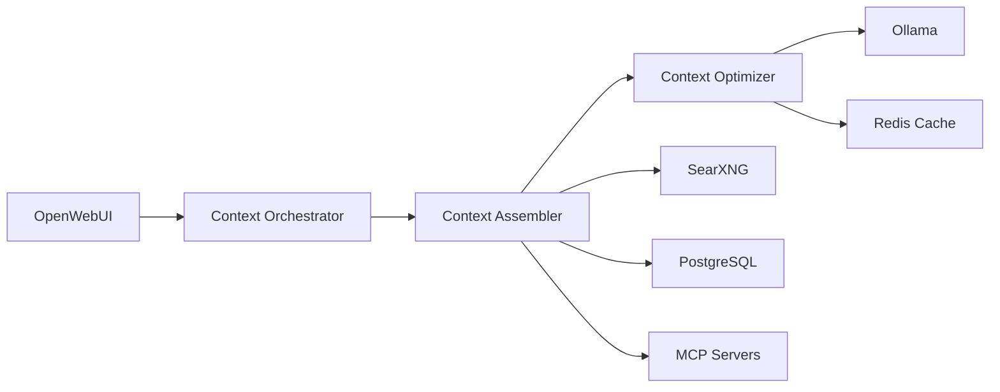

# 🧠 Context Engineering в ERNI-KI

> **Версия документа:** 1.0  
> **Дата создания:** 2025-07-15  
> **Статус:** Production Ready  
> **Автор:** Альтэон Шульц, Tech Lead

## 📋 Обзор

Context Engineering представляет собой эволюцию от простого prompt engineering к комплексной системе динамического управления контекстом для LLM. В ERNI-KI система интегрирована как дополнительный слой между OpenWebUI и Ollama для оптимизации производительности и качества ответов.

## 🏗️ Архитектура

### Компоненты Context Engineering



#### 🎯 Context Orchestrator
- **Порт**: 8090
- **Назначение**: Управление жизненным циклом контекста
- **Технология**: Go 1.23+
- **Функции**:
  - Координация между компонентами
  - Context lifecycle management
  - API gateway для context operations
  - Health monitoring и metrics

#### 🔧 Context Assembler
- **Интеграция**: Расширение OpenWebUI
- **Назначение**: Сборка контекста из множественных источников
- **Функции**:
  - Knowledge retrieval (SearXNG)
  - Memory management (PostgreSQL)
  - Tools integration (MCP)
  - Multi-modal context assembly

#### ⚡ Context Optimizer
- **Порт**: 8091
- **Назначение**: Оптимизация контекста для LLM
- **Технология**: Python 3.11+
- **Функции**:
  - Token budget management
  - Context compression
  - Adaptive filtering
  - Performance optimization

#### 💾 Context Cache
- **Интеграция**: Расширение Redis
- **Назначение**: Кэширование и state management
- **Функции**:
  - Context caching
  - State persistence
  - Session management
  - Performance acceleration

## 🚀 Установка и настройка

### Предварительные требования

- ERNI-KI система версии 2.0+
- Docker Compose 2.20+
- Свободная память: +2GB RAM
- Свободное место: +5GB disk

### Пошаговая установка

#### 1. Резервное копирование

```bash
# Создание полного бэкапа
docker compose exec backrest backrest backup --tag "pre-context-engineering-$(date +%Y%m%d)"

# Проверка бэкапа
docker compose exec backrest backrest snapshots
```

#### 2. Подготовка конфигурации

```bash
# Копирование конфигурационных файлов
cp env/context-orchestrator.env.example env/context-orchestrator.env
cp env/context-optimizer.env.example env/context-optimizer.env

# Редактирование настроек
nano env/context-orchestrator.env
nano env/context-optimizer.env
```

#### 3. Обновление Docker Compose

```bash
# Остановка системы
docker compose down

# Обновление конфигурации
cp compose.yml compose.yml.backup
cp compose.context-engineering.yml compose.yml

# Запуск с новыми сервисами
docker compose up -d
```

#### 4. Проверка установки

```bash
# Проверка статуса всех сервисов
docker compose ps

# Проверка health checks
docker compose exec context-orchestrator curl http://localhost:8090/health
docker compose exec context-optimizer curl http://localhost:8091/health
```

## ⚙️ Конфигурация

### Context Orchestrator настройки

```bash
# env/context-orchestrator.env
ORCHESTRATOR_PORT=8090
ORCHESTRATOR_LOG_LEVEL=info
ORCHESTRATOR_REDIS_URL=redis://redis:6379/2
ORCHESTRATOR_DB_URL=postgresql://user:pass@db:5432/openwebui
ORCHESTRATOR_OLLAMA_URL=http://ollama:11434
ORCHESTRATOR_OPTIMIZER_URL=http://context-optimizer:8091

# Производительность
ORCHESTRATOR_MAX_CONCURRENT=10
ORCHESTRATOR_TIMEOUT=30s
ORCHESTRATOR_CACHE_TTL=3600

# Мониторинг
ORCHESTRATOR_METRICS_ENABLED=true
ORCHESTRATOR_HEALTH_CHECK_INTERVAL=30s
```

### Context Optimizer настройки

```bash
# env/context-optimizer.env
OPTIMIZER_PORT=8091
OPTIMIZER_LOG_LEVEL=info
OPTIMIZER_REDIS_URL=redis://redis:6379/3

# Token Budget Management
OPTIMIZER_MAX_TOKENS=32768
OPTIMIZER_RESERVED_TOKENS=1024
OPTIMIZER_COMPRESSION_RATIO=0.7

# Оптимизация
OPTIMIZER_CACHE_ENABLED=true
OPTIMIZER_ADAPTIVE_FILTERING=true
OPTIMIZER_PERFORMANCE_MODE=balanced

# Алгоритмы
OPTIMIZER_COMPRESSION_ALGORITHM=semantic
OPTIMIZER_FILTERING_STRATEGY=relevance
```

### OpenWebUI интеграция

```bash
# Добавление в env/openwebui.env
CONTEXT_ENGINEERING_ENABLED=true
CONTEXT_ORCHESTRATOR_URL=http://context-orchestrator:8090
CONTEXT_OPTIMIZER_URL=http://context-optimizer:8091

# Настройки интеграции
CONTEXT_TIMEOUT=30
CONTEXT_RETRY_ATTEMPTS=3
CONTEXT_CACHE_ENABLED=true
```

## 📊 Мониторинг

### Health Checks

```bash
# Проверка всех Context Engineering сервисов
curl http://localhost:8090/health  # Context Orchestrator
curl http://localhost:8091/health  # Context Optimizer

# Детальная диагностика
curl http://localhost:8090/metrics
curl http://localhost:8091/metrics
```

### Производительность

```bash
# Мониторинг производительности
docker stats context-orchestrator context-optimizer

# Проверка GPU использования
docker compose exec ollama nvidia-smi

# Анализ времени отклика
curl -w "Time: %{time_total}s\n" http://localhost:8080/api/chat
```

### Логирование

```bash
# Просмотр логов Context Engineering
docker compose logs -f context-orchestrator
docker compose logs -f context-optimizer

# Анализ ошибок
docker compose logs context-orchestrator | grep ERROR
docker compose logs context-optimizer | grep ERROR
```

## 🔧 Использование

### API Context Engineering

#### Context Assembly

```bash
# Создание контекста
curl -X POST http://localhost:8090/api/context/assemble \
  -H "Content-Type: application/json" \
  -d '{
    "query": "Explain quantum computing",
    "sources": ["searxng", "memory", "tools"],
    "max_tokens": 16384
  }'
```

#### Context Optimization

```bash
# Оптимизация контекста
curl -X POST http://localhost:8091/api/optimize \
  -H "Content-Type: application/json" \
  -d '{
    "context": "...",
    "target_tokens": 8192,
    "strategy": "semantic_compression"
  }'
```

### Интеграция с OpenWebUI

Context Engineering автоматически интегрируется с OpenWebUI:

1. **Автоматическая сборка контекста** при каждом запросе
2. **Оптимизация token budget** для лучшей производительности
3. **Кэширование контекста** для ускорения повторных запросов
4. **Адаптивная фильтрация** на основе релевантности

## 🚨 Устранение неполадок

### Частые проблемы

#### Context Orchestrator не запускается

```bash
# Проверка логов
docker compose logs context-orchestrator

# Проверка зависимостей
docker compose ps redis db ollama

# Перезапуск сервиса
docker compose restart context-orchestrator
```

#### Медленная работа Context Optimizer

```bash
# Проверка использования ресурсов
docker stats context-optimizer

# Увеличение лимитов памяти в compose.yml
deploy:
  resources:
    limits:
      memory: 4G
```

#### Ошибки кэширования

```bash
# Очистка Redis кэша
docker compose exec redis redis-cli FLUSHDB

# Проверка подключения к Redis
docker compose exec context-orchestrator redis-cli -h redis ping
```

### Откат изменений

#### Автоматический откат

```bash
# Восстановление из бэкапа
docker compose exec backrest backrest restore --tag "pre-context-engineering-$(date +%Y%m%d)"

# Перезапуск системы
docker compose down
docker compose up -d
```

#### Ручной откат

```bash
# Отключение Context Engineering
cp compose.yml.backup compose.yml
docker compose down
docker compose up -d

# Проверка работоспособности
docker compose ps
curl -I https://your-domain.com/
```

## 📈 Оптимизация производительности

### Рекомендуемые настройки

#### Для высокой нагрузки

```bash
# env/context-orchestrator.env
ORCHESTRATOR_MAX_CONCURRENT=20
ORCHESTRATOR_TIMEOUT=60s
ORCHESTRATOR_CACHE_TTL=7200

# env/context-optimizer.env
OPTIMIZER_PERFORMANCE_MODE=high_performance
OPTIMIZER_COMPRESSION_RATIO=0.8
```

#### Для экономии ресурсов

```bash
# env/context-orchestrator.env
ORCHESTRATOR_MAX_CONCURRENT=5
ORCHESTRATOR_TIMEOUT=15s
ORCHESTRATOR_CACHE_TTL=1800

# env/context-optimizer.env
OPTIMIZER_PERFORMANCE_MODE=resource_efficient
OPTIMIZER_COMPRESSION_RATIO=0.6
```

### Мониторинг производительности

```bash
# Создание скрипта мониторинга
cat > scripts/monitor_context_engineering.sh << 'EOF'
#!/bin/bash
echo "=== Context Engineering Performance ==="
echo "Orchestrator Status:"
curl -s http://localhost:8090/health | jq .
echo "Optimizer Status:"
curl -s http://localhost:8091/health | jq .
echo "Resource Usage:"
docker stats --no-stream context-orchestrator context-optimizer
EOF

chmod +x scripts/monitor_context_engineering.sh
```

## 🔒 Безопасность

### Настройки безопасности

```bash
# Ограничение доступа к API
# В nginx конфигурации
location /api/context/ {
    auth_request /auth;
    proxy_pass http://context-orchestrator:8090;
}

# Rate limiting для Context API
limit_req_zone $binary_remote_addr zone=context_api:10m rate=10r/m;
```

### Мониторинг безопасности

```bash
# Проверка подозрительной активности
docker compose logs context-orchestrator | grep -i "error\|fail\|attack"
docker compose logs context-optimizer | grep -i "error\|fail\|attack"
```

## 📞 Поддержка

### Контакты

- **Tech Lead**: Альтэон Шульц
- **Документация**: `/docs/context-engineering.md`
- **Issues**: GitHub Issues
- **Мониторинг**: Grafana Dashboard

### Полезные ссылки

- [Context Engineering GitHub](https://github.com/davidkimai/context-engineering)
- [ERNI-KI Documentation](./README.md)
- [Architecture Overview](./architecture.md)
- [Troubleshooting Guide](./troubleshooting.md)
