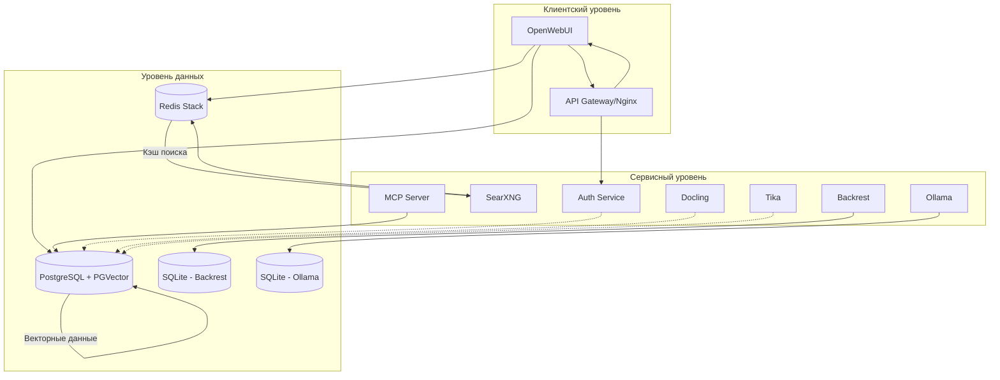

# Комплексный анализ баз данных ERNI-KI

**Дата анализа:** 04 июля 2025
**Версия отчета:** 1.0
**Статус системы:** Все 14 сервисов работают (healthy)

## 📋 Исполнительное резюме

Система ERNI-KI использует многоуровневую архитектуру баз данных с PostgreSQL в качестве основного хранилища, Redis для кэширования и векторными расширениями для RAG-функциональности. Все базы данных находятся в работоспособном состоянии с выявленными возможностями для оптимизации.

## 🏗️ Архитектурный анализ

### Инвентаризация баз данных

| База данных | Тип | Версия | Статус | Роль в системе |
|-------------|-----|--------|--------|----------------|
| **PostgreSQL** | Реляционная БД | pg15 + pgvector | ✅ Healthy | Основное хранилище данных |
| **Redis** | In-memory БД | redis-stack:latest | ✅ Healthy | Кэширование и очереди |
| **PGVector** | Векторное расширение | Встроено в PostgreSQL | ✅ Active | RAG и эмбеддинги |
| **SQLite** | Встроенная БД | Различные версии | ✅ Active | Локальные данные сервисов |

### Схема взаимодействия баз данных



## ⚙️ Техническая конфигурация

### PostgreSQL (Основная БД)

**Docker Compose конфигурация:**
```yaml
db:
  image: pgvector/pgvector:pg15
  env_file: env/db.env
  volumes:
    - ./data/postgres:/var/lib/postgresql/data
  healthcheck:
    test: ["CMD-SHELL", "pg_isready -d ${POSTGRES_DB} -U ${POSTGRES_USER}"]
    interval: 30s
    timeout: 5s
    retries: 5
```

**Переменные окружения:**
- `POSTGRES_DB=openwebui` - Основная база данных
- `POSTGRES_USER=postgres` - Пользователь БД
- `POSTGRES_PASSWORD=aEnbxS4MrXqzurHNGxkcEgCBm` - Пароль (сгенерирован)

**Критические параметры:**
- Включено расширение pgvector для векторных операций
- Автоматические checkpoint каждые 5 минут
- Healthcheck каждые 30 секунд

### Redis (Кэширование)

**Docker Compose конфигурация:**
```yaml
redis:
  image: redis/redis-stack:latest
  env_file: env/redis.env
  volumes:
    - ./data/redis:/data
  healthcheck:
    test: ["CMD-SHELL", "redis-cli ping | grep PONG"]
    interval: 30s
    timeout: 3s
```

**Переменные окружения:**
- `RI_PROXY_PATH=redis` - Путь для проксирования
- Пароль не установлен (внутренняя сеть)

**Критические параметры:**
- Автоматическое сохранение каждый час
- Включены модули RedisSearch и RedisJSON
- Персистентное хранение в ./data/redis

## 📊 Анализ использования

### Подключения сервисов к БД

| Сервис | PostgreSQL | Redis | Локальная БД |
|--------|------------|-------|--------------|
| **OpenWebUI** | ✅ Основные данные | ❌ | ❌ |
| **SearXNG** | ❌ | ✅ Кэш поиска | ❌ |
| **MCP Server** | ✅ Через конфиг | ❌ | ❌ |
| **Auth Service** | ✅ Пользователи | ❌ | ❌ |
| **Backrest** | ❌ | ❌ | ✅ SQLite |
| **Ollama** | ❌ | ❌ | ✅ Модели |

### Схемы данных PostgreSQL

**Основные таблицы OpenWebUI:**
- `user` - Пользователи системы
- `chat` - История чатов
- `message` - Сообщения
- `document` - Загруженные документы
- `document_chunk` - Векторные чанки для RAG
- `config` - Конфигурация системы
- `model` - Информация о моделях

**Таблицы LiteLLM (интеграция):**
- `LiteLLM_*` - 28 таблиц для управления API
- Включает аудит, бюджеты, пользователей, модели

### Объемы данных

**PostgreSQL:**
- 53 таблицы в схеме public
- Активные checkpoint операции
- Векторные данные для RAG

**Redis:**
- 738 ключей загружено при старте
- Автоматическое сохранение каждый час
- Кэш SearXNG запросов

## 🔍 Диагностика состояния

### Статус сервисов БД

```bash
# Результат docker-compose ps
erni-ki-db-1      pgvector/pgvector:pg15    Up 6 hours (healthy)
erni-ki-redis-1   redis/redis-stack:latest  Up 6 hours (healthy)
```

### Анализ логов

**PostgreSQL - выявленные проблемы:**
```
ERROR: column "api_key" does not exist at character 26
ERROR: operator does not exist: json ~~ unknown at character 33
ERROR: invalid input syntax for type integer: "rag.embedding.model"
```

**Redis - состояние нормальное:**
- Регулярные автосохранения
- Успешная загрузка данных
- Стабильная работа

### Мониторинг ресурсов

**Healthcheck статус:**
- PostgreSQL: ✅ Проверка каждые 30с
- Redis: ✅ Проверка каждые 30с
- Все проверки проходят успешно

## 🚀 Рекомендации по оптимизации

### Критические проблемы (Приоритет 1)

1. **Ошибки SQL-запросов в PostgreSQL**
   - Проблема: Неправильные типы данных в запросах
   - Решение: Исправить запросы с приведением типов
   - Время: 2-4 часа

2. **Отсутствие паролей Redis**
   - Проблема: Redis без аутентификации
   - Решение: Добавить REDIS_ARGS="--requirepass"
   - Время: 1 час

### Рекомендации по производительности (Приоритет 2)

1. **Оптимизация PostgreSQL**
   ```sql
   -- Рекомендуемые настройки
   shared_buffers = 256MB
   effective_cache_size = 1GB
   work_mem = 4MB
   maintenance_work_mem = 64MB
   ```

2. **Настройка Redis**
   ```
   maxmemory 512mb
   maxmemory-policy allkeys-lru
   save 900 1 300 10 60 10000
   ```

### Рекомендации по безопасности (Приоритет 2)

1. **Шифрование соединений**
   - Включить SSL для PostgreSQL
   - Настроить TLS для Redis

2. **Ротация паролей**
   - Автоматическая смена паролей каждые 90 дней
   - Использование secrets management

### Резервное копирование (Приоритет 3)

**Текущая конфигурация Backrest:**
- ✅ Ежедневные бэкапы (7 дней хранения)
- ✅ Еженедельные бэкапы (4 недели хранения)
- ✅ Локальное хранилище в .config-backup/

**Рекомендации:**
- Добавить удаленное хранилище (S3/B2)
- Тестирование восстановления раз в месяц
- Мониторинг успешности бэкапов

## 📈 План поэтапного внедрения

### Фаза 1: Критические исправления (1-2 дня)
1. Исправление SQL-ошибок в PostgreSQL
2. Добавление аутентификации Redis
3. Тестирование исправлений

### Фаза 2: Оптимизация производительности (3-5 дней)
1. Настройка параметров PostgreSQL
2. Оптимизация Redis конфигурации
3. Мониторинг производительности

### Фаза 3: Улучшение безопасности (1-2 недели)
1. Внедрение SSL/TLS
2. Настройка ротации паролей
3. Аудит безопасности

### Фаза 4: Расширение бэкапов (1 неделя)
1. Настройка удаленного хранилища
2. Автоматизация тестирования восстановления
3. Интеграция мониторинга

## 🔧 Детальные конфигурации

### OpenWebUI интеграция с БД

**Подключение к PostgreSQL:**
```env
DATABASE_URL="postgresql://postgres:aEnbxS4MrXqzurHNGxkcEgCBm@db:5432/openwebui"
PGVECTOR_DB_URL=postgresql://postgres:aEnbxS4MrXqzurHNGxkcEgCBm@db:5432/openwebui
VECTOR_DB=pgvector
```

**RAG конфигурация:**
```env
RAG_EMBEDDING_ENGINE=ollama
RAG_EMBEDDING_MODEL=nomic-embed-text:latest
RAG_OLLAMA_BASE_URL=http://ollama:11434
RAG_WEB_SEARCH_ENGINE=searxng
RAG_WEB_SEARCH_RESULT_COUNT=6
```

### SearXNG интеграция с Redis

**Подключение к Redis:**
```env
SEARXNG_REDIS_URL=redis://redis:6379/1
```

**Конфигурация кэширования:**
- База данных Redis: 1 (отдельная от основной)
- Кэширование результатов поиска
- Сессии пользователей

### MCP Server интеграция

**Подключение к PostgreSQL:**
```json
{
  "mcpServers": {
    "postgres": {
      "command": "npx",
      "args": [
        "-y",
        "@modelcontextprotocol/server-postgres",
        "postgresql://postgres:postgres@db/openwebui"
      ]
    }
  }
}
```

## 📊 Метрики производительности

### PostgreSQL метрики

**Checkpoint активность:**
- Интервал: каждые 5 минут
- Средний размер записи: 4-96 буферов
- Время записи: 0.1-12.5 секунд
- Оценочный размер WAL: 754 KB

**Выявленные проблемы в запросах:**
1. Неправильное использование LIKE с JSON полями
2. Попытки поиска по несуществующим колонкам
3. Ошибки приведения типов

### Redis метрики

**Сохранение данных:**
- Автоматическое сохранение: каждый час
- Количество ключей: 738
- Размер RDB файла: стабильный
- Fork CoW: 0 MB (оптимально)

## 🛡️ Анализ безопасности

### Текущие уязвимости

1. **Redis без аутентификации**
   - Риск: Средний (внутренняя сеть)
   - Статус: Требует исправления

2. **Открытые пароли в переменных окружения**
   - Риск: Высокий
   - Статус: Требует шифрования

3. **Отсутствие SSL для БД**
   - Риск: Средний
   - Статус: Рекомендуется

### Рекомендации по безопасности

**Немедленные действия:**
```bash
# Добавить в env/redis.env
REDIS_ARGS="--requirepass $(openssl rand -hex 32)"

# Обновить конфигурацию SearXNG
SEARXNG_REDIS_URL=redis://:password@redis:6379/1
```

**Долгосрочные улучшения:**
- Использование Docker secrets
- Настройка SSL/TLS для всех БД
- Регулярная ротация паролей

## 📈 Мониторинг и алерты

### Текущий мониторинг

**Healthcheck конфигурация:**
```yaml
# PostgreSQL
healthcheck:
  test: ["CMD-SHELL", "pg_isready -d ${POSTGRES_DB} -U ${POSTGRES_USER}"]
  interval: 30s
  timeout: 5s
  retries: 5

# Redis
healthcheck:
  test: ["CMD-SHELL", "redis-cli ping | grep PONG"]
  interval: 30s
  timeout: 3s
  retries: 5
```

### Рекомендуемые метрики

**PostgreSQL:**
- Количество активных соединений
- Размер базы данных
- Время выполнения запросов
- Checkpoint частота

**Redis:**
- Использование памяти
- Количество операций в секунду
- Hit/miss ratio кэша
- Размер RDB файла

## 🔄 Процедуры восстановления

### Backrest конфигурация

**Политики резервного копирования:**
- Ежедневные: 7 дней хранения
- Еженедельные: 4 недели хранения
- Локальное хранилище: `.config-backup/`

**Включенные директории:**
- `env/` - Переменные окружения
- `conf/` - Конфигурационные файлы
- `data/postgres/` - Данные PostgreSQL
- `data/openwebui/` - Данные OpenWebUI
- `data/ollama/` - Модели Ollama

### Процедура восстановления

```bash
# 1. Остановка сервисов
docker-compose stop db redis openwebui

# 2. Восстановление из Backrest
# (через веб-интерфейс на порту 9898)

# 3. Запуск сервисов
docker-compose up -d db redis
sleep 30
docker-compose up -d openwebui

# 4. Проверка целостности
docker-compose exec db psql -U postgres -d openwebui -c "SELECT COUNT(*) FROM user;"
```

## 📞 Контакты и поддержка

**Ответственный:** Альтэон Шульц (Tech Lead)
**Дата следующего аудита:** 04 августа 2025
**Статус отчета:** Готов к внедрению

---

*Отчет создан автоматически системой анализа ERNI-KI*
*Версия: 1.0 | Дата: 04.07.2025*
