# 🏗️ ERNI-KI Systemarchitektur

> **Dokumentversion:** 5.0 **Aktualisierungsdatum:** 2025-07-25 **Status:**
> Production Ready

## 📋 Architektur-Überblick

ERNI-KI ist eine moderne Microservice-basierte AI-Plattform, die auf den
Prinzipien der Containerisierung, Sicherheit und Skalierbarkeit aufbaut. Das
System besteht aus **25 miteinander verbundenen Services**, einschließlich
Komponenten wie LiteLLM, Docling, Context Engineering und einem vollständigen
Monitoring-Stack mit webhook-receiver für Alert-Verarbeitung, von denen jeder
eine spezialisierte Funktion erfüllt.

## 🎯 Architektur-Prinzipien

### 🔒 **Security First**

- JWT-Authentifizierung für alle API-Anfragen
- Rate Limiting und DDoS-Schutz
- SSL/TLS-Verschlüsselung des gesamten Traffics
- Service-Isolation über Docker Networks

### 📈 **Scalability & Performance**

- Horizontale Skalierung über Docker Compose
- GPU-Beschleunigung für AI-Berechnungen
- Caching über Redis
- Asynchrone Dokumentenverarbeitung

### 🛡️ **Reliability & Monitoring**

- Health Checks für alle Services
- Automatische Neustarts bei Ausfällen
- Zentralisiertes Logging
- Automatische Backups

## 🏛️ High-Level Diagramm

```mermaid
graph TB
    subgraph "🌐 External Layer"
        USER[👤 User Browser]
        CF[☁️ Cloudflare Zero Trust]
    end

    subgraph "🚪 Gateway Layer"
        NGINX[🚪 Nginx Reverse Proxy]
        AUTH[🔐 Auth Service JWT]
        TUNNEL[🔗 Cloudflared Tunnel]
    end

    subgraph "🤖 Application Layer"
        OWUI[🤖 Open WebUI]
        OLLAMA[🧠 Ollama LLM Server]
        SEARXNG[🔍 SearXNG Search]
        MCP[🔌 MCP Servers]
    end

    subgraph "🔧 Processing Layer"
        DOCLING[📄 Docling Parser]
        TIKA[📋 Apache Tika]
        EDGETTS[🎤 EdgeTTS Speech]
    end

    subgraph "💾 Data Layer"
        POSTGRES[(🗄️ PostgreSQL + pgvector)]
        REDIS[(⚡ Redis Cache)]
        BACKREST[💾 Backrest Backup]
    end

    subgraph "📊 Monitoring Layer"
        PROMETHEUS[📈 Prometheus Metrics]
        GRAFANA[📊 Grafana Dashboards]
        ALERTMANAGER[🚨 Alert Manager]
        WEBHOOK_REC[📨 Webhook Receiver]
        NODE_EXP[📊 Node Exporter]
        PG_EXP[📊 PostgreSQL Exporter]
        REDIS_EXP[📊 Redis Exporter]
        NVIDIA_EXP[📊 NVIDIA GPU Exporter]
        BLACKBOX_EXP[📊 Blackbox Exporter]
        CADVISOR[📊 cAdvisor Container Metrics]
    end

    subgraph "🛠️ Infrastructure Layer"
        WATCHTOWER[🔄 Watchtower Updates]
        DOCKER[🐳 Docker Engine]
    end

    %% External connections
    USER --> CF
    CF --> TUNNEL
    TUNNEL --> NGINX

    %% Gateway layer
    NGINX --> AUTH
    NGINX --> OWUI

    %% Application connections
    OWUI --> OLLAMA
    OWUI --> SEARXNG
    OWUI --> MCP
    OWUI --> DOCLING
    OWUI --> TIKA
    OWUI --> EDGETTS

    %% Data connections
    OWUI --> POSTGRES
    OWUI --> REDIS
    SEARXNG --> REDIS
    BACKREST --> POSTGRES
    BACKREST --> REDIS

    %% Infrastructure
    WATCHTOWER -.-> OWUI
    WATCHTOWER -.-> OLLAMA
    WATCHTOWER -.-> SEARXNG
```

## 🔧 Detaillierte Service-Architektur

### 🚪 **Gateway Layer (Gateway)**

#### Nginx Reverse Proxy

- **Zweck**: Einheitlicher Eingangspunkt, Load Balancing, SSL-Terminierung
- **Ports**: 80 (HTTP), 443 (HTTPS), 8080 (Internal)
- **Funktionen**:
  - Rate Limiting (100 req/min für allgemeine Anfragen, 10 req/min für SearXNG)
  - SSL/TLS-Terminierung mit modernen Cipher Suites
  - WebSocket-Verbindungen proxying
  - Statische Datei-Bereitstellung
  - Caching von statischem Content

#### Auth Service (JWT)

- **Technologie**: Go 1.23+
- **Port**: 9090
- **Funktionen**:
  - JWT-Token-Generierung und -Validierung
  - Integration mit nginx auth_request
  - Benutzer-Session-Management
  - Rate Limiting für Authentifizierung

#### Cloudflared Tunnel

- **Zweck**: Sichere Verbindung zu Cloudflare Zero Trust
- **Funktionen**:
  - Verschlüsselte Tunnel ohne offene Ports
  - Automatisches SSL-Zertifikat-Management
  - DDoS-Schutz auf Cloudflare-Ebene
  - Geografische Traffic-Verteilung

### 🤖 **Application Layer (Anwendungen)**

#### Open WebUI

- **Technologie**: Python FastAPI + Svelte
- **Port**: 8080
- **GPU**: NVIDIA CUDA-Unterstützung
- **Funktionen**:
  - Web-Interface für AI-Modelle
  - RAG (Retrieval-Augmented Generation) Suche
  - Chat- und Verlaufs-Management
  - Integration mit externen Services
  - Dokument-Upload und -Verarbeitung
  - Sprach-Ein-/Ausgabe

#### Ollama LLM Server

- **Technologie**: Go + CUDA
- **Port**: 11434
- **GPU**: Vollständige NVIDIA GPU-Unterstützung
- **Funktionen**:
  - Lokale Ausführung von Sprachmodellen
  - Automatisches GPU-Speicher-Management
  - OpenAI-kompatible API
  - Multi-Modell-Unterstützung
  - Streaming-Antworten

#### SearXNG Search Engine

- **Technologie**: Python Flask
- **Port**: 8080 (internal)
- **Funktionen**:
  - Meta-Suchmaschine (Google, Bing, DuckDuckGo)
  - Private Suche ohne Tracking
  - JSON API für RAG-Integration
  - Ergebnis-Caching in Redis
  - Rate Limiting und Blockierungs-Schutz

#### MCP Servers

- **Technologie**: Model Context Protocol
- **Port**: 8000
- **Funktionen**:
  - AI-Funktionserweiterung durch Tools
  - Integration mit externen APIs
  - Code- und Befehlsausführung
  - Datenbankzugriff

### 🔧 **Processing Layer (Verarbeitung)**

#### Docling Document Parser

- **Technologie**: Python + AI-Modelle
- **Port**: 5001
- **Funktionen**:
  - Textextraktion aus PDF, DOCX, PPTX
  - OCR für gescannte Dokumente
  - Strukturelle Dokumentenanalyse
  - Tabellen- und Bildunterstützung

#### Apache Tika

- **Technologie**: Java
- **Port**: 9998
- **Funktionen**:
  - Metadaten-Extraktion aus Dateien
  - Unterstützung für 1000+ Dateiformate
  - Dateityp-Erkennung
  - Text- und Strukturextraktion

#### EdgeTTS Speech Synthesis

- **Technologie**: Python + Microsoft Edge TTS
- **Port**: 5050
- **Funktionen**:
  - Hochqualitative Sprachsynthese
  - Multi-Sprach- und Stimmen-Unterstützung
  - Streaming-Audio
  - Open WebUI-Integration

### 💾 **Data Layer (Daten)**

#### PostgreSQL + pgvector

- **Version**: PostgreSQL 16 + pgvector Extension
- **Port**: 5432
- **Funktionen**:
  - Haupt-Anwendungsdatenbank
  - Vektor-Speicher für RAG
  - Volltext-Suche
  - ACID-Transaktionen
  - Replikation und Backups

#### Redis Cache

- **Version**: Redis Stack (Redis + RedisInsight)
- **Ports**: 6379 (Redis), 8001 (RedisInsight)
- **Funktionen**:
  - Suchanfragen-Caching
  - Benutzer-Sessions
  - Task-Queues
  - Pub/Sub für Real-time-Benachrichtigungen

#### Backrest Backup System

- **Technologie**: Go + Restic
- **Port**: 9898
- **Funktionen**:
  - Automatische inkrementelle Backups
  - Datenverschlüsselung
  - Deduplizierung
  - Web-Management-Interface
  - Point-in-Time-Recovery

### 🛠️ **Infrastructure Layer (Infrastruktur)**

#### Watchtower Auto-updater

- **Funktionen**:
  - Automatische Docker-Image-Updates
  - Überwachung neuer Versionen
  - Graceful Service-Neustarts
  - Update-Benachrichtigungen

## 🌐 Netzwerk-Architektur

### Ports und Protokolle

| Service    | Externer Port | Interner Port | Protokoll  | Zweck                |
| ---------- | ------------- | ------------- | ---------- | -------------------- |
| nginx      | 80, 443, 8080 | 80, 443, 8080 | HTTP/HTTPS | Web Gateway          |
| auth       | -             | 9090          | HTTP       | JWT-Validierung      |
| openwebui  | -             | 8080          | HTTP/WS    | AI-Interface         |
| ollama     | -             | 11434         | HTTP       | LLM API              |
| db         | -             | 5432          | PostgreSQL | Datenbank            |
| redis      | -             | 6379, 8001    | Redis/HTTP | Cache & UI           |
| searxng    | -             | 8080          | HTTP       | Such-API             |
| mcposerver | -             | 8000          | HTTP       | MCP-Protokoll        |
| docling    | -             | 5001          | HTTP       | Dokument-Parsing     |
| tika       | -             | 9998          | HTTP       | Metadaten-Extraktion |
| edgetts    | -             | 5050          | HTTP       | Sprachsynthese       |
| backrest   | 9898          | 9898          | HTTP       | Backup-Management    |

### Docker Networks

- **erni-ki_default**: Haupt-Netzwerk für alle Services
- **Isolation**: Jeder Service nur über Container-Namen erreichbar
- **DNS**: Automatische Namensauflösung über Docker DNS

## 🔄 Datenflüsse

### Benutzeranfrage

1. **Browser** → **Cloudflare** → **Cloudflared** → **Nginx**
2. **Nginx** → **Auth Service** (JWT-Validierung)
3. **Nginx** → **Open WebUI** (Haupt-Interface)
4. **Open WebUI** → **Ollama** (Antwort-Generierung)
5. **Open WebUI** → **PostgreSQL** (Verlaufs-Speicherung)

### RAG-Suche

1. **Open WebUI** → **SearXNG** (Informationssuche)
2. **SearXNG** → **Redis** (Ergebnis-Caching)
3. **Open WebUI** → **PostgreSQL/pgvector** (Vektor-Suche)
4. **Open WebUI** → **Ollama** (Generierung mit Kontext)

### Dokumentenverarbeitung

1. **Open WebUI** → **Docling/Tika** (Dokument-Parsing)
2. **Open WebUI** → **PostgreSQL/pgvector** (Vektor-Speicherung)
3. **Open WebUI** → **Ollama** (Inhalts-Analyse)

## 📊 Monitoring und Observability

### Health Checks

- Alle Services haben konfigurierte Health Checks
- Automatischer Neustart bei Ausfällen
- Überwachung über `docker compose ps`

### Logging

- Zentralisierte Logs über Docker Logging Driver
- Log-Rotation zur Festplatten-Überlauf-Vermeidung
- Strukturiertes Logging im JSON-Format

### Metriken

- Ressourcenverbrauch über `docker stats`
- GPU-Überwachung über nvidia-smi
- Datenbank-Performance-Monitoring

## 🔧 Konfiguration und Deployment

### Umgebungsvariablen

- Jeder Service hat separate `.env`-Datei
- Automatische Generierung geheimer Schlüssel
- Konfiguration über Docker Compose

### Skalierung

- Horizontale Skalierung über Docker Compose scale
- Load Balancing über Nginx upstream
- Automatische Erkennung neuer Instanzen

### Sicherheit

- Minimale Berechtigungen für alle Container
- Netzwerk- und Dateisystem-Isolation
- Regelmäßige Sicherheitsupdates über Watchtower

---

**📝 Hinweis**: Diese Architektur ist für den Produktionseinsatz optimiert mit
Fokus auf Sicherheit, Performance und Zuverlässigkeit.
