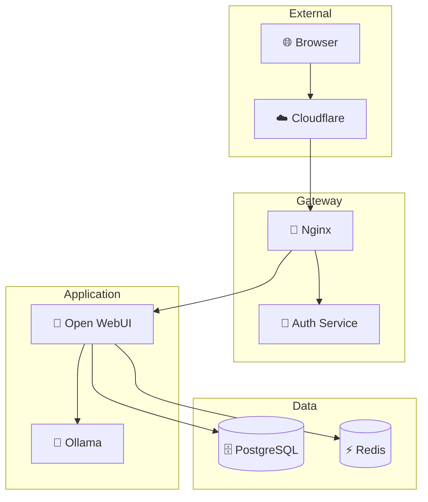

# ERNI-KI Documentation

{ align=right width=200 }

Добро пожаловать в документацию проекта **ERNI-KI** — современной AI платформы
на базе Open WebUI с полной контейнеризацией и production-ready конфигурацией.

## 🚀 Что такое ERNI-KI?

ERNI-KI — это комплексное решение для развертывания локальной AI платформы,
включающее:

- **🤖 Open WebUI** — пользовательский интерфейс для работы с AI
- **🧠 Ollama** — локальный сервер для языковых моделей
- **🔐 JWT Authentication** — безопасная аутентификация
- **🌐 Nginx** — reverse proxy и балансировщик нагрузки
- **🗄️ PostgreSQL + PgVector** — база данных с поддержкой векторов
- **⚡ Redis** — кэширование и сессии
- **🔍 SearXNG** — метапоисковик
- **☁️ Cloudflare Zero Trust** — безопасный туннель

## ✨ Ключевые особенности

### 🏗️ Production-Ready

- Полная контейнеризация с Docker Compose
- Автоматические health checks
- Мониторинг с Prometheus и Grafana
- CI/CD pipeline с GitHub Actions

### 🔒 Безопасность

- JWT аутентификация для всех сервисов
- Cloudflare Zero Trust туннель
- Регулярные security сканы
- Политики безопасности

### 📊 Мониторинг

- Метрики всех сервисов
- Алерты в реальном времени
- Дашборды Grafana
- Логирование и трейсинг

### 🛠️ Разработка

- Настроенная среда разработки
- Автоматическое тестирование
- Линтинг и форматирование
- Документация API

## 🎯 Быстрый старт

### Предварительные требования

- **Docker** и **Docker Compose**
- **Git** для клонирования репозитория
- **Cloudflare аккаунт** для туннеля (опционально)
- **GPU** для Ollama (рекомендуется)

### Установка за 5 минут

```bash
# 1. Клонируем репозиторий
git clone https://github.com/DIZ-admin/erni-ki.git
cd erni-ki

# 2. Копируем конфигурационные файлы
cp compose.yml.example compose.yml
cp .env.template .env

# 3. Настраиваем переменные окружения
nano .env  # Заполните секретные ключи

# 4. Запускаем сервисы
docker compose up -d

# 5. Загружаем первую модель
docker compose exec ollama ollama pull llama3.2:3b
```

### Первый вход

1. Откройте браузер и перейдите на `http://localhost`
2. Создайте аккаунт администратора
3. Настройте подключение к Ollama
4. Начните общение с AI! 🎉

## 📚 Документация

### 🚀 Для пользователей

- [📖 Руководство пользователя](user-guide.md) — работа с интерфейсом
- [⚡ Быстрое развертывание](quick-deployment-guide.md) — установка за 5 минут
- [🔧 Руководство по установке](installation-guide.md) — детальная установка

### 🏗️ Для разработчиков

- [🏛️ Архитектура системы](architecture.md) — обзор архитектуры
- [💻 Разработка](development.md) — настройка среды разработки
- [🔌 API справочник](api-reference.md) — документация API

### 👨‍💼 Для администраторов

- [🛠️ Руководство администратора](admin-guide.md) — управление системой
- [📊 Процедуры мониторинга](monitoring-procedures.md) — **НОВОЕ** мониторинг и
  алерты
- [⚙️ Управление ресурсами](resource-management.md) — **НОВОЕ** оптимизация
  производительности
- [🔒 Конфигурация безопасности](security-configuration.md) — **НОВОЕ**
  настройки безопасности

### 🔧 Специализированные руководства

- [🔍 Оптимизация SearXNG](searxng-optimization-guide.md) — настройка поиска
- [🗄️ Обслуживание PostgreSQL](postgresql-maintenance-guide.md) — работа с БД
- [💾 Резервное копирование](local-backup-restore-guide.md) — backup и
  восстановление
- [🤖 Context Engineering](context-engineering.md) — работа с AI контекстом

## 🏗️ Архитектура



## 🤝 Сообщество

### Поддержка

- 📧 **Email**: support@erni-ki.local
- 💬 **Discord**: [Присоединиться к серверу](https://discord.gg/erni-ki)
- 🐛 **Issues**: [GitHub Issues](https://github.com/DIZ-admin/erni-ki/issues)

### Контрибуция

Мы приветствуем вклад в развитие проекта! Ознакомьтесь с
[руководством по контрибуции](development/contributing.md).

### Лицензия

Проект распространяется под лицензией MIT. Подробности в файле
[LICENSE](https://github.com/DIZ-admin/erni-ki/blob/main/LICENSE).

## 📈 Статистика проекта


---

**Последнее обновление**: {{ git_revision_date_localized }}

**Версия документации**: {{ config.extra.version.default }}
