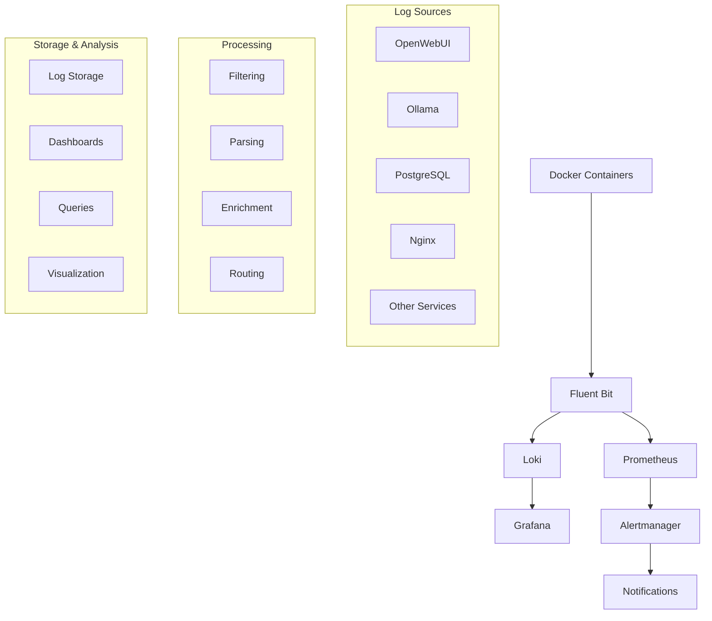

# 📋 РУКОВОДСТВО ПО ЛОГИРОВАНИЮ ERNI-KI

**Версия:** 2.0 **Дата:** 2025-08-26 **Статус:** Активно

## 🎯 Обзор

Данное руководство описывает стандартизированную систему логирования ERNI-KI, включающую 30+
сервисов с централизованным сбором, анализом и мониторингом логов.

## 📊 Архитектура системы логирования



## 🏗️ Стандарты логирования

### Уровни логирования по типам сервисов

| Тип сервиса         | Уровень | Формат | Примеры                                     |
| ------------------- | ------- | ------ | ------------------------------------------- |
| **Критические**     | INFO    | JSON   | OpenWebUI, Ollama, PostgreSQL, Nginx        |
| **Важные**          | INFO    | JSON   | SearXNG, Redis, Backrest, Auth, Cloudflared |
| **Вспомогательные** | WARN    | JSON   | Docling, EdgeTTS, Tika, MCP Server          |
| **Мониторинговые**  | ERROR   | LOGFMT | Prometheus, Grafana, Exporters              |

### Стандартная структура JSON логов

```json
{
  "timestamp": "2025-08-26T08:18:00.123Z",
  "level": "INFO",
  "service": "openwebui",
  "component": "auth",
  "message": "User authenticated successfully",
  "request_id": "req-123456",
  "user_id": "user-789",
  "duration_ms": 45,
  "environment": "production",
  "version": "2.0"
}
```

## 🔧 Конфигурация сервисов

### Добавление логирования в новый сервис

1. **Добавьте в env файл:**

```bash
# === СТАНДАРТИЗИРОВАННОЕ ЛОГИРОВАНИЕ ===
LOG_LEVEL=info
LOG_FORMAT=json
```

1. **Настройте в compose.yml:**

```yaml
services:
  your-service:
    logging:
      driver: 'json-file'
      options:
        max-size: '20m'
        max-file: '5'
        compress: 'true'
        labels: 'service,environment'
        tag: '{{.ImageName}}/{{.Name}}/{{.ID}}'
    labels:
      - 'logging.level=info'
      - 'logging.format=json'
      - 'service.type=important'
```

### Оптимизация health check логов

Для исключения избыточных health check логов используйте конфигурацию nginx:

```nginx
# В nginx.conf
map $request_uri $loggable {
    ~^/health$ 0;
    ~^/healthz$ 0;
    ~^/-/healthy$ 0;
    ~^/api/health$ 0;
    ~^/metrics$ 0;
    default 1;
}

access_log /var/log/nginx/access.log combined if=$loggable;
```

## 📈 Мониторинг и алертинг

### Ключевые метрики

1. **Объем логов:** `rate(container_log_entries_total[5m])`
2. **Уровень ошибок:** `rate(container_log_entries_total{level="error"}[5m])`
3. **Производительность:** `fluentbit_output_proc_records_total`
4. **Использование ресурсов:** `container_memory_usage_bytes`

### Критические алерты

- **HighErrorRateInCriticalServices:** >10 ошибок/мин в критических сервисах
- **CriticalKeywordsInLogs:** Обнаружение CRITICAL/FATAL/PANIC
- **DatabaseConnectionFailure:** Ошибки подключения к БД
- **LokiDown:** Недоступность системы хранения логов

## 🛠️ Troubleshooting через логи

### Диагностика проблем по сервисам

#### OpenWebUI

```bash
# Ошибки аутентификации
docker logs erni-ki-openwebui-1 | grep -i "auth.*error"

# Проблемы с API
docker logs erni-ki-openwebui-1 | grep -i "api.*error\|timeout"

# Проблемы с базой данных
docker logs erni-ki-openwebui-1 | grep -i "database.*error"
```

#### Ollama

```bash
# Проблемы с GPU
docker logs erni-ki-ollama-1 | grep -i "gpu\|cuda\|vram"

# Проблемы с моделями
docker logs erni-ki-ollama-1 | grep -i "model.*error\|load.*failed"

# Проблемы с памятью
docker logs erni-ki-ollama-1 | grep -i "memory\|oom"
```

#### PostgreSQL

```bash
# Ошибки подключения
docker logs erni-ki-db-1 | grep -i "connection.*error\|authentication"

# Проблемы с производительностью
docker logs erni-ki-db-1 | grep -i "slow.*query\|deadlock"

# Проблемы с дисковым пространством
docker logs erni-ki-db-1 | grep -i "disk.*full\|space"
```

### Анализ производительности

```bash
# Топ-10 сервисов по объему логов
for container in $(docker ps --format "{{.Names}}" | grep erni-ki); do
    lines=$(docker logs --since 1h "$container" 2>&1 | wc -l)
    echo "$container: $lines строк"
done | sort -k2 -nr | head -10

# Анализ ошибок за последний час
for container in $(docker ps --format "{{.Names}}" | grep erni-ki); do
    errors=$(docker logs --since 1h "$container" 2>&1 | grep -i -E "(error|critical|fatal)" | wc -l)
    if [[ $errors -gt 0 ]]; then
        echo "$container: $errors ошибок"
    fi
done
```

## 🗂️ Архивирование и очистка

### Автоматическая очистка

Используйте скрипт `scripts/monitoring/log-cleanup.sh`:

```bash
# Запуск очистки
./scripts/monitoring/log-cleanup.sh

# Добавление в cron для еженедельной очистки
0 2 * * 0 /path/to/erni-ki/scripts/monitoring/log-cleanup.sh
```

### Политики хранения

| Тип сервиса     | Локальное хранение | Архив   | Общий срок |
| --------------- | ------------------ | ------- | ---------- |
| Критические     | 7 дней             | 90 дней | 97 дней    |
| Важные          | 5 дней             | 30 дней | 35 дней    |
| Вспомогательные | 3 дня              | 14 дней | 17 дней    |
| Мониторинговые  | 2 дня              | 7 дней  | 9 дней     |

## 🔍 Поиск и анализ в Grafana

### Полезные запросы Loki

```logql
# Все ошибки за последний час
{level="error"} |= "" | json

# Ошибки в критических сервисах
{service_type="critical",level="error"} |= ""

# Медленные запросы
{service="openwebui"} |= "slow" | json | duration > 1000

# Проблемы с аутентификацией
{} |~ "(?i)auth.*error|authentication.*failed"

# Анализ трендов ошибок
rate({level="error"}[5m])
```

### Создание пользовательских дашбордов

1. Откройте Grafana: `https://your-domain/grafana`
2. Создайте новый дашборд
3. Добавьте панели с запросами из примеров выше
4. Настройте алерты для критических метрик

## ⚡ Оптимизация производительности

### Рекомендации по настройке

1. **Fluent Bit:**
   - Увеличьте `storage.backlog.mem_limit` до 16MB
   - Используйте `storage.max_chunks_up 128`
   - Настройте `Grace 30` для корректного завершения

2. **Docker логирование:**
   - Используйте сжатие: `compress: "true"`
   - Ограничьте размер файлов: `max-size: "50m"`
   - Настройте ротацию: `max-file: "7"`

3. **Loki:**
   - Настройте индексирование только нужных лейблов
   - Используйте сжатие чанков
   - Настройте правильные retention policies

## 🚨 Экстренные процедуры

### При переполнении дискового пространства

```bash
# Экстренная очистка Docker логов
docker system prune -f --volumes

# Очистка старых логов (>7 дней)
find /var/lib/docker/containers -name "*.log" -mtime +7 -delete

# Перезапуск логирования
docker restart erni-ki-fluent-bit
```

### При недоступности Loki

```bash
# Проверка статуса
docker logs erni-ki-loki

# Перезапуск с очисткой
docker stop erni-ki-loki
docker rm erni-ki-loki
docker-compose up -d loki
```

## 📞 Контакты и поддержка

- **Документация:** `/docs/logging-guide.md`
- **Конфигурация:** `/conf/logging/`
- **Скрипты:** `/scripts/monitoring/`
- **Дашборды:** `/conf/grafana/dashboards/`

---

## 📋 Чек-лист для администраторов

### Ежедневные задачи

- [ ] Проверить дашборд "ERNI-KI Logging Overview"
- [ ] Просмотреть критические алерты
- [ ] Проверить использование дискового пространства
- [ ] Убедиться в работоспособности Fluent Bit и Loki

### Еженедельные задачи

- [ ] Запустить скрипт анализа объемов логов
- [ ] Проверить эффективность фильтров
- [ ] Обновить правила алертинга при необходимости
- [ ] Провести очистку старых архивов

### Ежемесячные задачи

- [ ] Проанализировать тренды логирования
- [ ] Оптимизировать конфигурацию сервисов
- [ ] Обновить документацию
- [ ] Провести тестирование процедур восстановления

## 🔄 История изменений

| Версия | Дата       | Изменения                                 |
| ------ | ---------- | ----------------------------------------- |
| 2.0    | 2025-08-26 | Полная стандартизация системы логирования |
| 1.5    | 2025-08-20 | Добавление Fluent Bit и Loki              |
| 1.0    | 2025-08-15 | Базовая конфигурация Docker логирования   |

**Примечание:** Данное руководство регулярно обновляется. Проверяйте актуальную версию в
репозитории.
