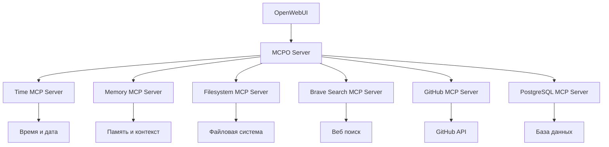

# MCP (Model Context Protocol) Integration в ERNI-KI

## 🎯 Обзор

ERNI-KI интегрирует MCP (Model Context Protocol) через MCPO (MCP Orchestrator), который преобразует MCP серверы в OpenAPI endpoints для использования в OpenWebUI.

## 🏗️ Архитектура



## 📦 Компоненты

### MCPO (MCP Orchestrator)
- **Порт**: 8000
- **Функция**: Прокси-сервер для MCP серверов
- **OpenAPI**: http://localhost:8000/docs
- **Конфигурация**: `conf/mcposerver/config.json`

### MCP Серверы

#### 1. Time Server
- **Функция**: Предоставляет текущее время и дату
- **Endpoint**: `/time/tools`
- **Возможности**: Получение времени в разных часовых поясах

#### 2. Memory Server
- **Функция**: Долгосрочная память для AI ассистента
- **Endpoint**: `/memory/tools`
- **Возможности**: Сохранение и извлечение контекста

#### 3. Filesystem Server
- **Функция**: Безопасный доступ к файловой системе
- **Endpoint**: `/filesystem/tools`
- **Разрешенные директории**: `/app/data`

#### 4. Brave Search Server
- **Функция**: Веб поиск через Brave Search API
- **Endpoint**: `/brave-search/tools`
- **API Key**: Демо ключ (требует замены для продакшена)

#### 5. GitHub Server
- **Функция**: Интеграция с GitHub API
- **Endpoint**: `/github/tools`
- **Token**: Демо токен (требует замены для продакшена)

#### 6. PostgreSQL Server
- **Функция**: Доступ к базе данных
- **Endpoint**: `/postgres/tools`
- **База данных**: OpenWebUI PostgreSQL

## ⚙️ Конфигурация

### Переменные окружения OpenWebUI

```bash
# MCP Tool Server Connections
TOOL_SERVER_CONNECTIONS=[{"name": "MCPO Server", "url": "http://mcposerver:8000", "enabled": true}]

# Настройки для MCP интеграции
ENABLE_DIRECT_CONNECTIONS=true
USER_PERMISSIONS_FEATURES_DIRECT_TOOL_SERVERS=true
ENABLE_OPENAPI_SERVERS=true
```

### Конфигурация MCPO

Файл: `conf/mcposerver/config.json`

```json
{
  "mcpServers": {
    "time": {
      "command": "uvx",
      "args": ["mcp-server-time", "--local-timezone=Europe/Berlin"],
      "env": {"TZ": "Europe/Berlin"}
    },
    "memory": {
      "command": "npx",
      "args": ["-y", "@modelcontextprotocol/server-memory"],
      "env": {"MEMORY_STORAGE_PATH": "/app/data/mcp-memory"}
    },
    "filesystem": {
      "command": "npx",
      "args": ["-y", "@modelcontextprotocol/server-filesystem", "/app/data"],
      "env": {"FILESYSTEM_ALLOWED_DIRECTORIES": "/app/data"}
    }
  }
}
```

## 🚀 Использование

### 1. Проверка статуса MCP серверов

```bash
# Проверка MCPO
curl http://localhost:8000/docs

# Проверка доступных endpoints
curl http://localhost:8000/openapi.json | jq '.paths | keys'

# Проверка конкретного сервера
curl http://localhost:8000/time/tools
```

### 2. Настройка в OpenWebUI

1. Откройте административную панель OpenWebUI
2. Перейдите в Settings > Connections
3. Добавьте новое подключение:
   - **Name**: MCPO Server
   - **URL**: http://mcposerver:8000
   - **Type**: OpenAPI Server

### 3. Использование в чате

После настройки MCP tools будут доступны в интерфейсе чата:

- **Время**: "Какое сейчас время в Берлине?"
- **Память**: "Запомни, что пользователь предпочитает Python"
- **Файлы**: "Покажи содержимое директории /app/data"
- **Поиск**: "Найди информацию о квантовых компьютерах"

## 🔧 Диагностика

### Проверка статуса

```bash
# Запуск теста интеграции
./scripts/mcp/test-mcp-integration.sh

# Проверка логов MCPO
docker logs erni-ki-mcposerver-1

# Проверка логов OpenWebUI
docker logs erni-ki-openwebui-1 | grep -i mcp
```

### Типичные проблемы

#### 1. MCP серверы не запускаются
- **Причина**: Отсутствуют зависимости (uvx, npx)
- **Решение**: Проверить логи MCPO, обновить образ

#### 2. Endpoints не создаются
- **Причина**: Серверы еще инициализируются
- **Решение**: Подождать 1-2 минуты после запуска

#### 3. OpenWebUI не видит tools
- **Причина**: Неправильная конфигурация connections
- **Решение**: Проверить TOOL_SERVER_CONNECTIONS

## 📊 Мониторинг

### Метрики производительности

- **Время отклика MCPO**: <2s
- **Время инициализации**: 1-2 минуты
- **Использование памяти**: ~200MB
- **Использование CPU**: <5%

### Health checks

```bash
# MCPO health
curl http://localhost:8000/docs

# Отдельные серверы
curl http://localhost:8000/time/tools
curl http://localhost:8000/memory/tools
curl http://localhost:8000/filesystem/tools
```

## 🔒 Безопасность

### Рекомендации для продакшена

1. **API Keys**: Замените демо ключи на реальные
2. **Filesystem**: Ограничьте доступные директории
3. **Database**: Используйте отдельного пользователя с ограниченными правами
4. **Network**: Настройте firewall для MCPO порта

### Конфигурация безопасности

```json
{
  "filesystem": {
    "env": {
      "FILESYSTEM_ALLOWED_DIRECTORIES": "/app/data/safe-directory"
    }
  },
  "postgres": {
    "env": {
      "POSTGRES_CONNECTION_STRING": "postgresql://mcp_user:secure_password@db/openwebui"
    }
  }
}
```

## 🔄 Обновления

### Обновление MCP серверов

```bash
# Перезапуск MCPO с новой конфигурацией
docker-compose restart mcposerver

# Проверка новых серверов
curl http://localhost:8000/openapi.json
```

### Добавление новых серверов

1. Обновите `conf/mcposerver/config.json`
2. Перезапустите MCPO
3. Проверьте доступность новых endpoints
4. Обновите документацию

## 📚 Дополнительные ресурсы

- [MCP Specification](https://spec.modelcontextprotocol.io/)
- [MCPO Documentation](https://github.com/open-webui/mcpo)
- [OpenWebUI Tools Guide](https://docs.openwebui.com/pipelines/openapi-servers/)
- [MCP Server Examples](https://github.com/modelcontextprotocol/servers)

## 🎯 Критерии успеха

- ✅ MCPO сервер запущен и отвечает на /docs
- ✅ MCP серверы инициализированы и создают endpoints
- ✅ OpenWebUI подключен к MCPO
- ✅ Tools доступны в интерфейсе чата
- ✅ Время отклика <2s
- ✅ Нет ошибок в логах
- ✅ Документация актуальна
