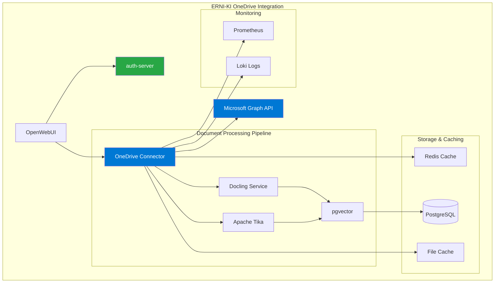
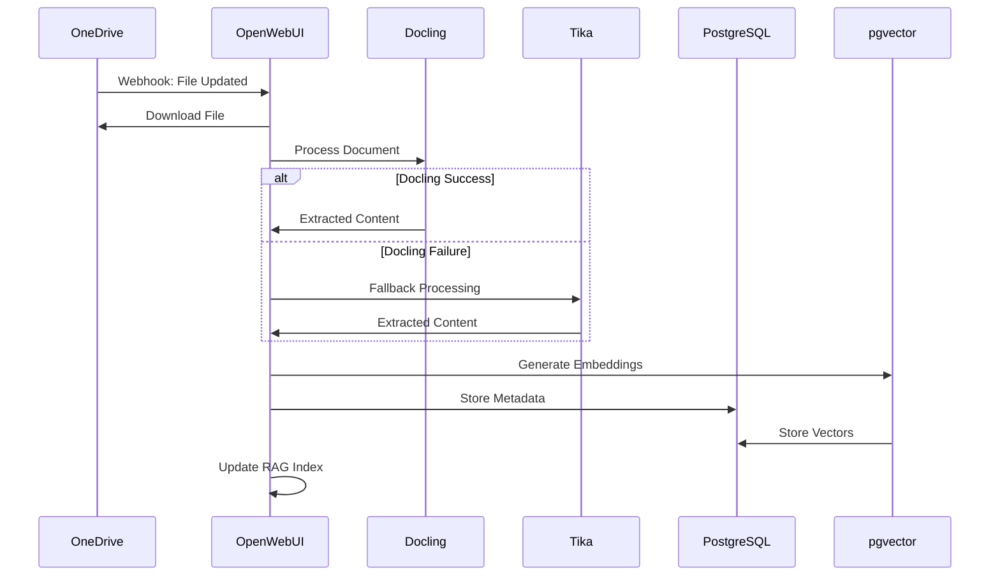

# OneDrive интеграция в OpenWebUI для ERNI-KI

**Дата:** 29 августа 2025 **Версия:** 1.0 **Автор:** Альтэон Шульц, Tech Lead

## 📋 Обзор

Данное руководство описывает интеграцию OneDrive в OpenWebUI с корпоративной аутентификацией через
Microsoft Entra ID для ERNI-KI системы. Интеграция обеспечивает доступ к корпоративным документам,
автоматическую синхронизацию с RAG системой и безопасное управление файлами.

---

## 🔍 1. Анализ интеграции OneDrive

### 1.1 Возможности интеграции OneDrive в OpenWebUI

OneDrive интеграция в OpenWebUI предоставляет следующие возможности:

**📁 Управление документами:**

- Загрузка файлов из OneDrive в RAG систему
- Автоматическая синхронизация изменений
- Поддержка различных форматов (PDF, DOCX, XLSX, TXT, MD)
- Иерархическая навигация по папкам

**🔍 RAG интеграция:**

- Автоматическая индексация документов в векторную базу
- Поиск по содержимому файлов OneDrive
- Контекстные ответы на основе корпоративных документов
- Отслеживание источников информации

**🔐 Безопасность:**

- OAuth 2.0 аутентификация через Microsoft Entra ID
- Соблюдение корпоративных политик доступа
- Аудит операций с файлами
- Шифрование данных в транзите и покое

### 1.2 Методы аутентификации

| Метод                   | OAuth 2.0        | Service Principal  | Managed Identity |
| ----------------------- | ---------------- | ------------------ | ---------------- |
| **Безопасность**        | Высокая          | Очень высокая      | Максимальная     |
| **Управление**          | Пользовательское | Централизованное   | Автоматическое   |
| **Масштабируемость**    | Средняя          | Высокая            | Максимальная     |
| **Сложность настройки** | Низкая           | Средняя            | Высокая          |
| **Подходит для**        | Разработка       | Продуктивная среда | Azure-hosted     |

### 1.3 Microsoft Graph API ограничения и квоты

**Стандартные лимиты:**

- **Запросы в секунду:** 10,000 для приложения
- **Запросы в минуту:** 600,000 для приложения
- **Размер файла:** До 250 GB через resumable upload
- **Batch запросы:** До 20 операций в одном batch

**Throttling политики:**

- Экспоненциальная задержка при превышении лимитов
- Автоматическое восстановление после throttling
- Приоритизация критических операций

---

## 🔧 2. Техническая реализация

### 2.1 Конфигурационные параметры

Для включения OneDrive интеграции в OpenWebUI необходимы следующие переменные окружения:

```bash
# === ONEDRIVE INTEGRATION ===
# Включить OneDrive интеграцию
ENABLE_ONEDRIVE_INTEGRATION=true

# Microsoft Graph API endpoint
MICROSOFT_GRAPH_ENDPOINT=https://graph.microsoft.com/v1.0

# === AZURE APP REGISTRATION ===
# Application (client) ID из Azure App Registration
AZURE_CLIENT_ID=your-client-id-here

# Client secret из Azure App Registration
AZURE_CLIENT_SECRET=your-client-secret-here

# Directory (tenant) ID
AZURE_TENANT_ID=your-tenant-id-here

# Redirect URI для OAuth flow
AZURE_REDIRECT_URI=https://your-domain.com/api/auth/microsoft/callback

# === ONEDRIVE SETTINGS ===
# Автоматическая синхронизация с RAG
ONEDRIVE_AUTO_SYNC_RAG=true

# Интервал синхронизации (минуты)
ONEDRIVE_SYNC_INTERVAL=30

# Максимальный размер файла для обработки (100MB)
ONEDRIVE_MAX_FILE_SIZE=104857600

# Поддерживаемые форматы файлов
ONEDRIVE_SUPPORTED_FORMATS=pdf,docx,xlsx,pptx,txt,md,csv

# Папки для синхронизации (разделенные запятыми)
ONEDRIVE_SYNC_FOLDERS=Documents,Shared Documents,AI Training Data

# === CACHING ===
# Кэширование токенов (секунды)
ONEDRIVE_TOKEN_CACHE_TTL=3600

# Кэширование метаданных файлов
ONEDRIVE_METADATA_CACHE_TTL=1800
```

### 2.2 Microsoft Graph API разрешения

Необходимые разрешения для Azure App Registration:

**Delegated permissions (для пользовательского доступа):**

```
Files.Read.All          - Чтение всех файлов пользователя
Files.ReadWrite.All     - Чтение и запись всех файлов
Sites.Read.All          - Доступ к SharePoint сайтам
User.Read               - Базовая информация о пользователе
offline_access          - Refresh tokens для долгосрочного доступа
```

**Application permissions (для сервисного доступа):**

```
Files.Read.All          - Чтение файлов всех пользователей
Files.ReadWrite.All     - Запись файлов всех пользователей
Sites.Read.All          - Доступ ко всем SharePoint сайтам
User.Read.All           - Чтение профилей пользователей
```

### 2.3 Совместимость с ERNI-KI архитектурой

**Интеграция с существующими сервисами:**



**Nginx proxy конфигурация:**

- Маршрутизация Microsoft Graph API запросов
- SSL termination для OAuth callbacks
- Rate limiting для API запросов
- Кэширование статических ресурсов

---

## 📖 3. Практическое руководство

### 3.1 Регистрация Azure приложения

#### Шаг 1: Создание App Registration

```bash
# Создание приложения через Azure CLI
az ad app create \
  --display-name "ERNI-KI OneDrive Integration" \
  --sign-in-audience "AzureADMyOrg" \
  --web-redirect-uris "https://your-domain.com/api/auth/microsoft/callback" \
  --required-resource-accesses @app-permissions.json

# Создание Service Principal
az ad sp create --id <application-id>

# Создание client secret
az ad app credential reset --id <application-id> --append
```

#### Шаг 2: Конфигурация разрешений (app-permissions.json)

```json
[
  {
    "resourceAppId": "00000003-0000-0000-c000-000000000000",
    "resourceAccess": [
      {
        "id": "df021288-bdef-4463-88db-98f22de89214",
        "type": "Role"
      },
      {
        "id": "75359482-378d-4052-8f01-80520e7db3cd",
        "type": "Scope"
      },
      {
        "id": "863451e7-0667-486c-a5d6-d135439485f0",
        "type": "Scope"
      }
    ]
  }
]
```

### 3.2 Конфигурация OpenWebUI

#### Обновление env/openwebui.env

```bash
# Добавить в env/openwebui.env
cat >> env/openwebui.env << 'EOF'

# === ONEDRIVE INTEGRATION ===
# Включить OneDrive интеграцию для корпоративных документов
ENABLE_ONEDRIVE_INTEGRATION=true

# Microsoft Graph API настройки
MICROSOFT_GRAPH_ENDPOINT=https://graph.microsoft.com/v1.0
MICROSOFT_GRAPH_BETA_ENDPOINT=https://graph.microsoft.com/beta

# Azure App Registration (замените на ваши значения)
AZURE_CLIENT_ID=your-client-id-from-app-registration
AZURE_CLIENT_SECRET=your-client-secret-from-app-registration
AZURE_TENANT_ID=your-tenant-id
AZURE_REDIRECT_URI=https://your-domain.com/api/auth/microsoft/callback

# OneDrive синхронизация
ONEDRIVE_AUTO_SYNC_RAG=true
ONEDRIVE_SYNC_INTERVAL=30
ONEDRIVE_MAX_FILE_SIZE=104857600
ONEDRIVE_SUPPORTED_FORMATS=pdf,docx,xlsx,pptx,txt,md,csv,json

# Папки для автоматической синхронизации
ONEDRIVE_SYNC_FOLDERS=Documents,AI Training Data,Knowledge Base

# Производительность и кэширование
ONEDRIVE_TOKEN_CACHE_TTL=3600
ONEDRIVE_METADATA_CACHE_TTL=1800
ONEDRIVE_CONCURRENT_DOWNLOADS=5
ONEDRIVE_BATCH_SIZE=20

# === HYBRID DOCUMENT PROCESSING ===
# Использовать OneDrive + локальные файлы
ENABLE_HYBRID_DOCUMENT_SOURCES=true
HYBRID_SYNC_PRIORITY=onedrive,local,web

EOF
```

#### Обновление docker-compose.yml

```yaml
# Добавить в сервис openwebui
services:
  openwebui:
    environment:
      # OneDrive Integration
      - ENABLE_ONEDRIVE_INTEGRATION=${ENABLE_ONEDRIVE_INTEGRATION:-false}
      - MICROSOFT_GRAPH_ENDPOINT=${MICROSOFT_GRAPH_ENDPOINT:-https://graph.microsoft.com/v1.0}
      - MICROSOFT_GRAPH_BETA_ENDPOINT=${MICROSOFT_GRAPH_BETA_ENDPOINT:-https://graph.microsoft.com/beta}

      # Azure Authentication
      - AZURE_CLIENT_ID=${AZURE_CLIENT_ID}
      - AZURE_CLIENT_SECRET=${AZURE_CLIENT_SECRET}
      - AZURE_TENANT_ID=${AZURE_TENANT_ID}
      - AZURE_REDIRECT_URI=${AZURE_REDIRECT_URI}

      # OneDrive Settings
      - ONEDRIVE_AUTO_SYNC_RAG=${ONEDRIVE_AUTO_SYNC_RAG:-true}
      - ONEDRIVE_SYNC_INTERVAL=${ONEDRIVE_SYNC_INTERVAL:-30}
      - ONEDRIVE_MAX_FILE_SIZE=${ONEDRIVE_MAX_FILE_SIZE:-104857600}
      - ONEDRIVE_SUPPORTED_FORMATS=${ONEDRIVE_SUPPORTED_FORMATS}
      - ONEDRIVE_SYNC_FOLDERS=${ONEDRIVE_SYNC_FOLDERS}

      # Caching
      - ONEDRIVE_TOKEN_CACHE_TTL=${ONEDRIVE_TOKEN_CACHE_TTL:-3600}
      - ONEDRIVE_METADATA_CACHE_TTL=${ONEDRIVE_METADATA_CACHE_TTL:-1800}
      - ONEDRIVE_CONCURRENT_DOWNLOADS=${ONEDRIVE_CONCURRENT_DOWNLOADS:-5}
      - ONEDRIVE_BATCH_SIZE=${ONEDRIVE_BATCH_SIZE:-20}

      # Hybrid Processing
      - ENABLE_HYBRID_DOCUMENT_SOURCES=${ENABLE_HYBRID_DOCUMENT_SOURCES:-false}
      - HYBRID_SYNC_PRIORITY=${HYBRID_SYNC_PRIORITY:-onedrive,local,web}
```

### 3.3 OAuth Consent настройка

#### Настройка Admin Consent

```bash
# Предоставление admin consent для всех пользователей
az ad app permission admin-consent --id <application-id>

# Проверка статуса разрешений
az ad app permission list --id <application-id>
```

#### Настройка Conditional Access (опционально)

```json
{
  "displayName": "ERNI-KI OneDrive Access Policy",
  "state": "enabled",
  "conditions": {
    "applications": {
      "includeApplications": ["<your-app-id>"]
    },
    "users": {
      "includeGroups": ["<ai-users-group-id>"]
    }
  },
  "grantControls": {
    "operator": "AND",
    "builtInControls": ["mfa", "compliantDevice"]
  }
}
```

---

## 🏗️ 4. Интеграция с ERNI-KI

### 4.1 Влияние на существующую архитектуру

**Изменения в nginx proxy:**

- Новые маршруты для Microsoft Graph API
- OAuth callback handling
- Rate limiting для OneDrive операций

**Изменения в auth-server:**

- Поддержка Microsoft OAuth tokens
- Token refresh механизм
- Интеграция с существующей JWT аутентификацией

**Изменения в PostgreSQL:**

- Новые таблицы для OneDrive метаданных
- Индексы для быстрого поиска файлов
- Связи с векторными данными

### 4.2 План миграции с минимальным downtime

#### Фаза 1: Подготовка (0 downtime)

```bash
# 1. Создание Azure App Registration
./scripts/setup-onedrive-integration.sh --create-app

# 2. Обновление конфигурации (без перезапуска)
cp env/openwebui.env env/openwebui.env.backup
echo "# OneDrive config" >> env/openwebui.env

# 3. Подготовка базы данных
./scripts/prepare-onedrive-schema.sql
```

#### Фаза 2: Развертывание (< 60 секунд downtime)

```bash
# 1. Обновление контейнера с новой конфигурацией
docker-compose up -d openwebui

# 2. Проверка здоровья
./scripts/test-onedrive-integration.sh

# 3. Откат при необходимости
# docker-compose down openwebui && cp env/openwebui.env.backup env/openwebui.env && docker-compose up -d openwebui
```

#### Фаза 3: Верификация (0 downtime)

```bash
# Тестирование всех интеграций
./scripts/comprehensive-onedrive-test.sh
```

### 4.3 Рекомендации по безопасности

#### Хранение токенов

```bash
# Использование Redis для безопасного хранения токенов
REDIS_TOKEN_ENCRYPTION_KEY=your-32-byte-encryption-key
REDIS_TOKEN_TTL=3600

# Шифрование client secrets в переменных окружения
AZURE_CLIENT_SECRET_ENCRYPTED=true
ENCRYPTION_KEY_PATH=/secrets/encryption.key
```

#### Мониторинг безопасности

```yaml
# Prometheus метрики для OneDrive операций
onedrive_auth_failures_total onedrive_api_rate_limit_hits_total
onedrive_token_refresh_failures_total onedrive_unauthorized_access_attempts_total
```

#### Аудит операций

```json
{
  "timestamp": "2025-08-29T10:30:00Z",
  "user": "user@company.com",
  "action": "file_download",
  "resource": "/Documents/sensitive-doc.pdf",
  "ip_address": "192.168.1.100",
  "user_agent": "ERNI-KI-OpenWebUI/1.0",
  "status": "success"
}
```

---

## 🔄 5. RAG и документооборот

### 5.1 Автоматическая индексация документов

#### Webhook настройка для real-time синхронизации

```bash
# Microsoft Graph webhook subscription
POST https://graph.microsoft.com/v1.0/subscriptions
{
  "changeType": "created,updated,deleted",
  "notificationUrl": "https://your-domain.com/api/webhooks/onedrive",
  "resource": "/me/drive/root",
  "expirationDateTime": "2025-09-29T10:30:00Z",
  "clientState": "your-secret-state"
}
```

#### Обработка изменений файлов

```python
# Псевдокод обработки webhook событий
def handle_onedrive_webhook(event):
    if event.changeType == "created":
        download_and_index_file(event.resource)
    elif event.changeType == "updated":
        reindex_file(event.resource)
    elif event.changeType == "deleted":
        remove_from_index(event.resource)
```

### 5.2 Синхронизация с векторной базой данных

#### Конфигурация pgvector интеграции

```sql
-- Создание таблицы для OneDrive метаданных
CREATE TABLE onedrive_files (
    id UUID PRIMARY KEY DEFAULT gen_random_uuid(),
    file_id VARCHAR(255) UNIQUE NOT NULL,
    file_name VARCHAR(500) NOT NULL,
    file_path TEXT NOT NULL,
    file_size BIGINT,
    mime_type VARCHAR(100),
    last_modified TIMESTAMP WITH TIME ZONE,
    created_at TIMESTAMP WITH TIME ZONE DEFAULT NOW(),
    updated_at TIMESTAMP WITH TIME ZONE DEFAULT NOW(),
    sync_status VARCHAR(50) DEFAULT 'pending',
    embedding_id UUID REFERENCES embeddings(id),
    INDEX idx_file_id (file_id),
    INDEX idx_sync_status (sync_status),
    INDEX idx_last_modified (last_modified)
);

-- Связь с векторными данными
CREATE TABLE onedrive_embeddings (
    id UUID PRIMARY KEY DEFAULT gen_random_uuid(),
    file_id UUID REFERENCES onedrive_files(id),
    chunk_index INTEGER,
    content TEXT,
    embedding vector(1536),
    metadata JSONB,
    created_at TIMESTAMP WITH TIME ZONE DEFAULT NOW()
);

-- Индекс для векторного поиска
CREATE INDEX idx_onedrive_embeddings_vector
ON onedrive_embeddings USING ivfflat (embedding vector_cosine_ops);
```

### 5.3 Обработка различных форматов файлов

#### Интеграция с Docling и Tika

```yaml
# Конфигурация обработки файлов
document_processors:
  pdf:
    primary: docling
    fallback: tika
    extract_images: true
    ocr_enabled: true

  docx:
    primary: docling
    extract_tables: true
    preserve_formatting: true

  xlsx:
    primary: tika
    extract_sheets: all
    include_formulas: false

  pptx:
    primary: docling
    extract_slides: true
    include_notes: true
```

#### Многоязычная OCR конфигурация

```bash
# Поддержка немецкого, английского, французского, итальянского
DOCLING_OCR_LANGUAGES=deu,eng,fra,ita
DOCLING_AUTO_LANGUAGE_DETECTION=true
DOCLING_OCR_CONFIDENCE_THRESHOLD=0.8
```

### 5.4 Интеграция с существующими сервисами

#### Workflow обработки документов



---

## 📊 6. Мониторинг и алертинг

### 6.1 Prometheus метрики

```yaml
# OneDrive интеграция метрики
onedrive_files_total{status="synced|pending|failed"} onedrive_sync_duration_seconds
onedrive_api_requests_total{method="GET|POST|PATCH",status="2xx|4xx|5xx"}
onedrive_token_refresh_total{status="success|failure"}
onedrive_webhook_events_total{type="created|updated|deleted"}
onedrive_file_processing_duration_seconds{processor="docling|tika"} onedrive_storage_usage_bytes
onedrive_rate_limit_remaining
```

### 6.2 Grafana дашборд

```json
{
  "dashboard": {
    "title": "ERNI-KI OneDrive Integration",
    "panels": [
      {
        "title": "OneDrive Sync Status",
        "type": "stat",
        "targets": [
          {
            "expr": "sum by (status) (onedrive_files_total)"
          }
        ]
      },
      {
        "title": "API Request Rate",
        "type": "graph",
        "targets": [
          {
            "expr": "rate(onedrive_api_requests_total[5m])"
          }
        ]
      },
      {
        "title": "File Processing Time",
        "type": "heatmap",
        "targets": [
          {
            "expr": "histogram_quantile(0.95, rate(onedrive_file_processing_duration_seconds_bucket[5m]))"
          }
        ]
      }
    ]
  }
}
```

### 6.3 Alerting правила

```yaml
# Prometheus alerting rules
groups:
  - name: onedrive_integration
    rules:
      - alert: OneDriveHighFailureRate
        expr: rate(onedrive_api_requests_total{status=~"4xx|5xx"}[5m]) > 0.1
        for: 2m
        labels:
          severity: warning
        annotations:
          summary: 'High OneDrive API failure rate'
          description: 'OneDrive API failure rate is {{ $value }} requests/sec'

      - alert: OneDriveTokenRefreshFailure
        expr: increase(onedrive_token_refresh_total{status="failure"}[10m]) > 3
        for: 1m
        labels:
          severity: critical
        annotations:
          summary: 'OneDrive token refresh failures'
          description: 'Multiple OneDrive token refresh failures detected'

      - alert: OneDriveSyncLag
        expr: time() - onedrive_last_successful_sync_timestamp > 3600
        for: 5m
        labels:
          severity: warning
        annotations:
          summary: 'OneDrive sync lag detected'
          description: "OneDrive hasn't synced successfully for over 1 hour"
```

---

## 🧪 7. Тестирование и troubleshooting

### 7.1 Процедуры тестирования

#### Тест подключения к Microsoft Graph

```bash
# Тест базового подключения
curl -H "Authorization: Bearer $ACCESS_TOKEN" \
  "https://graph.microsoft.com/v1.0/me/drive"

# Тест списка файлов
curl -H "Authorization: Bearer $ACCESS_TOKEN" \
  "https://graph.microsoft.com/v1.0/me/drive/root/children"
```

#### Тест OAuth flow

```bash
# Получение authorization code
https://login.microsoftonline.com/{tenant}/oauth2/v2.0/authorize?
  client_id={client_id}&
  response_type=code&
  redirect_uri={redirect_uri}&
  response_mode=query&
  scope=Files.Read.All%20Files.ReadWrite.All%20offline_access

# Обмен code на access token
curl -X POST https://login.microsoftonline.com/{tenant}/oauth2/v2.0/token \
  -H "Content-Type: application/x-www-form-urlencoded" \
  -d "client_id={client_id}&client_secret={client_secret}&code={code}&redirect_uri={redirect_uri}&grant_type=authorization_code"
```

### 7.2 Troubleshooting guide

#### Частые проблемы и решения

**Проблема: "invalid_client" ошибка**

```bash
# Решение: Проверить client_id и client_secret
az ad app show --id $AZURE_CLIENT_ID
az ad app credential list --id $AZURE_CLIENT_ID
```

**Проблема: "insufficient_privileges" ошибка**

```bash
# Решение: Предоставить admin consent
az ad app permission admin-consent --id $AZURE_CLIENT_ID
```

**Проблема: Rate limiting (429 ошибки)**

```bash
# Решение: Реализовать exponential backoff
ONEDRIVE_RETRY_ATTEMPTS=3
ONEDRIVE_RETRY_DELAY=1
ONEDRIVE_BACKOFF_MULTIPLIER=2
```

**Проблема: Token expiration**

```bash
# Решение: Автоматический refresh токенов
ONEDRIVE_AUTO_TOKEN_REFRESH=true
ONEDRIVE_TOKEN_REFRESH_THRESHOLD=300  # 5 минут до истечения
```

### 7.3 Логирование и диагностика

#### Структурированное логирование

```json
{
  "timestamp": "2025-08-29T10:30:00Z",
  "level": "INFO",
  "component": "onedrive_connector",
  "operation": "file_sync",
  "file_id": "01BYE5RZ6QN3ZWBTUFOFD3GSPGOHDJD36K",
  "file_name": "document.pdf",
  "duration_ms": 1250,
  "status": "success",
  "metadata": {
    "file_size": 2048576,
    "mime_type": "application/pdf",
    "processing_engine": "docling"
  }
}
```

#### Debug режим

```bash
# Включение детального логирования
ONEDRIVE_DEBUG_MODE=true
ONEDRIVE_LOG_LEVEL=DEBUG
ONEDRIVE_LOG_API_REQUESTS=true
ONEDRIVE_LOG_TOKEN_OPERATIONS=false  # Безопасность!
```

---

## 📚 Заключение

OneDrive интеграция в ERNI-KI обеспечивает:

✅ **Бесшовный доступ** к корпоративным документам ✅ **Автоматическую синхронизацию** с RAG
системой ✅ **Корпоративную безопасность** через Azure Entra ID ✅ **Масштабируемость** для больших
объемов данных ✅ **Мониторинг и алертинг** для операционной стабильности

**Следующие шаги:**

1. Выполнить настройку Azure App Registration
2. Обновить конфигурацию ERNI-KI
3. Протестировать интеграцию
4. Настроить мониторинг
5. Обучить пользователей новым возможностям

**Документация и поддержка:**

- `scripts/setup-onedrive-integration.sh` - Автоматизированная настройка
- `scripts/test-onedrive-integration.sh` - Комплексное тестирование
- `docs/onedrive-troubleshooting.md` - Детальный troubleshooting guide
