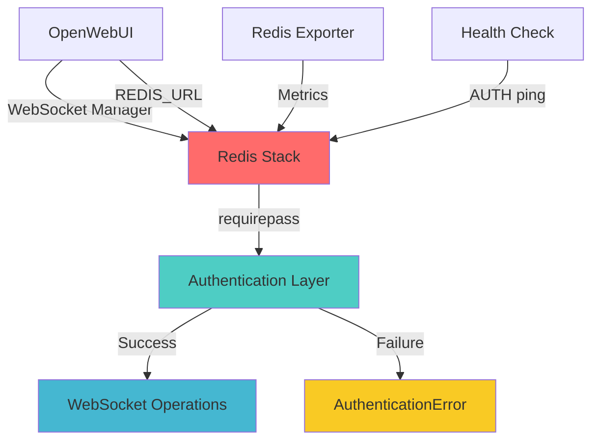

# 🔐 Redis Stack Аутентификация - Техническое Руководство

**Версия:** 1.0  
**Дата:** 2025-08-29  
**Применимо к:** ERNI-KI v2.0+

## 📋 **Обзор**

Данное руководство описывает правильную настройку Redis Stack аутентификации для
работы с OpenWebUI WebSocket поддержкой в системе ERNI-KI.

## 🏗️ **Архитектура Redis аутентификации**



## ⚙️ **Конфигурация Redis Stack**

### **1. Основная конфигурация (compose.yml)**

```yaml
redis:
  depends_on:
    watchtower:
      condition: service_healthy
  env_file: env/redis.env
  command: >
    redis-stack-server
    --requirepass ErniKiRedisSecurePassword2024
    --save ""
    --appendonly yes
    --maxmemory-policy allkeys-lru
  healthcheck:
    test: ["CMD-SHELL", "redis-cli -a 'ErniKiRedisSecurePassword2024' ping | grep PONG"]
    interval: 30s
    timeout: 3s
    retries: 5
    start_period: 20s
  image: redis/redis-stack:latest
  logging: *important-logging
  restart: unless-stopped
  volumes:
    - ./data/redis:/data
```

### **2. Переменные окружения (env/redis.env)**

```bash
# === Аутентификация ===
# Простой пароль без специальных символов для совместимости с async Redis клиентом
REDIS_PASSWORD=ErniKiRedisSecurePassword2024

# === Оптимизация производительности ===
REDIS_OVERCOMMIT_MEMORY=1
REDIS_SAVE_POLICY=""
REDIS_MAXMEMORY_POLICY=allkeys-lru

# === Логирование ===
REDIS_LOG_LEVEL=notice
```

## 🌐 **Конфигурация OpenWebUI WebSocket**

### **1. WebSocket настройки (env/openwebui.env)**

```bash
# === WEBSOCKET И REDIS ===
# WebSocket поддержка для кластерных развертываний
ENABLE_WEBSOCKET_SUPPORT=true
WEBSOCKET_MANAGER=redis

# Redis URL для WebSocket (простой формат без URL кодирования)
REDIS_URL=redis://:ErniKiRedisSecurePassword2024@redis:6379/0
WEBSOCKET_REDIS_URL=redis://:ErniKiRedisSecurePassword2024@redis:6379/0
```

### **2. Важные принципы URL формата:**

#### ✅ **Правильный формат:**

```bash
redis://:password@host:port/database
redis://:ErniKiRedisSecurePassword2024@redis:6379/0
```

#### ❌ **Неправильные форматы:**

```bash
# Специальные символы без кодирования
redis://:80u7dxerdVK+ZaKp2drp76OKtH0O1EYXLwebTQ/q7mA=@redis:6379/0

# Неправильное URL кодирование
redis://:80u7dxerdVK%2BZaKp2drp76OKtH0O1EYXLwebTQ%2Fq7mA%3D@redis:6379/0
```

## 📊 **Мониторинг и метрики**

### **1. Redis Exporter конфигурация**

```yaml
redis-exporter:
  depends_on:
    watchtower:
      condition: service_healthy
    redis:
      condition: service_healthy
  image: oliver006/redis_exporter:latest
  container_name: erni-ki-redis-exporter
  environment:
    - REDIS_ADDR=redis://:ErniKiRedisSecurePassword2024@redis:6379
    - REDIS_EXPORTER_INCL_SYSTEM_METRICS=true
  ports:
    - '9121:9121'
```

### **2. Ключевые метрики для мониторинга:**

- **Redis подключения:** `redis_connected_clients`
- **Аутентификация:** `redis_keyspace_hits_total`
- **Память:** `redis_memory_used_bytes`
- **WebSocket операции:** Логи OpenWebUI

## 🔧 **Troubleshooting Guide**

### **1. Проблема: AuthenticationError**

#### **Симптомы:**

```
redis.exceptions.AuthenticationError: invalid username-password pair
```

#### **Диагностика:**

```bash
# Проверка Redis аутентификации
docker exec erni-ki-redis-1 redis-cli -a 'ErniKiRedisSecurePassword2024' ping

# Проверка конфигурации OpenWebUI
docker logs erni-ki-openwebui-1 | grep -i redis
```

#### **Решение:**

1. Убедиться, что пароль в `env/redis.env` совпадает с `compose.yml`
2. Проверить URL формат в `env/openwebui.env`
3. Перезапустить Redis и OpenWebUI

### **2. Проблема: WebSocket не работает**

#### **Симптомы:**

```
Invalid transport (further occurrences of this error will be logged with level INFO)
```

#### **Диагностика:**

```bash
# Проверка WebSocket настроек
grep -i websocket env/openwebui.env

# Проверка Redis подключения
curl -f http://localhost:8080/health
```

#### **Решение:**

1. Убедиться, что `ENABLE_WEBSOCKET_SUPPORT=true`
2. Проверить `WEBSOCKET_MANAGER=redis`
3. Валидировать `WEBSOCKET_REDIS_URL`

### **3. Проблема: Redis Exporter не работает**

#### **Симптомы:**

```
Error connecting to Redis: dial tcp: connection refused
```

#### **Решение:**

1. Проверить `REDIS_ADDR` в конфигурации exporter
2. Убедиться, что Redis запущен и healthy
3. Проверить сетевую связность между контейнерами

## ✅ **Checklist для проверки конфигурации**

### **Перед развертыванием:**

- [ ] Пароль Redis не содержит специальных символов (`+`, `/`, `=`)
- [ ] Пароль одинаковый в `env/redis.env` и `compose.yml`
- [ ] URL формат корректный в `env/openwebui.env`
- [ ] Redis Exporter использует тот же пароль
- [ ] Healthcheck настроен с правильным паролем

### **После развертывания:**

- [ ] Redis контейнер в статусе "healthy"
- [ ] OpenWebUI контейнер в статусе "healthy"
- [ ] Redis Exporter работает (порт 9121)
- [ ] 0 ошибок аутентификации в логах OpenWebUI
- [ ] WebSocket подключения работают

### **Тестирование:**

- [ ] `redis-cli -a 'password' ping` возвращает PONG
- [ ] `redis-cli ping` возвращает NOAUTH (без пароля)
- [ ] `curl http://localhost:8080/health` возвращает 200
- [ ] Нет ошибок в логах за последние 5 минут

## 🔄 **Процедура смены пароля Redis**

### **1. Подготовка:**

```bash
# Создание бэкапа конфигурации
cp env/redis.env env/redis.env.backup
cp compose.yml compose.yml.backup
```

### **2. Обновление конфигурации:**

```bash
# 1. Обновить env/redis.env
REDIS_PASSWORD=NewSecurePassword2024

# 2. Обновить compose.yml (Redis Stack)
--requirepass NewSecurePassword2024

# 3. Обновить compose.yml (Redis Exporter)
REDIS_ADDR=redis://:NewSecurePassword2024@redis:6379

# 4. Обновить env/openwebui.env
REDIS_URL=redis://:NewSecurePassword2024@redis:6379/0
WEBSOCKET_REDIS_URL=redis://:NewSecurePassword2024@redis:6379/0
```

### **3. Применение изменений:**

```bash
# Остановка сервисов
docker-compose stop redis redis-exporter openwebui

# Запуск с новой конфигурацией
docker-compose up -d redis
sleep 10
docker-compose up -d redis-exporter openwebui

# Проверка статуса
docker-compose ps redis redis-exporter openwebui
```

### **4. Валидация:**

```bash
# Тест аутентификации
docker exec erni-ki-redis-1 redis-cli -a 'NewSecurePassword2024' ping

# Проверка отсутствия ошибок
docker logs erni-ki-openwebui-1 --since="2m" | grep -i redis | wc -l
```

## 📚 **Дополнительные ресурсы**

- [Redis Stack Documentation](https://redis.io/docs/stack/)
- [OpenWebUI WebSocket Configuration](https://docs.openwebui.com/)
- [Redis Exporter Metrics](https://github.com/oliver006/redis_exporter)

---

**Автор:** Альтэон Шульц (Tech Lead)  
**Версия:** 1.0  
**Дата создания:** 2025-08-29
