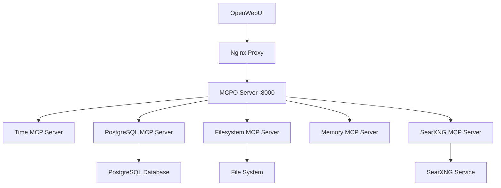

# 🔧 Руководство по интеграции MCP в ERNI-KI

> **Версия документа:** 9.0 **Дата обновления:** 2025-11-14 **Статус:** ✅
> Healthy (порт 8000, интеграция с LiteLLM/Context7 подтверждена)

## 📋 Обзор MCP (Model Context Protocol)

MCP Server в ERNI-KI предоставляет стандартизированный интерфейс для интеграции
AI-инструментов с OpenWebUI v0.6.26 через Model Context Protocol. Система
включает 4 активных MCP инструмента:

- **Time Server** - работа с временем и часовыми поясами
- **PostgreSQL Server** - выполнение SQL запросов к базе данных (PostgreSQL
  15.13 + pgvector 0.8.0)
- **Filesystem Server** - операции с файловой системой
- **Memory Server** - управление графом знаний

**Текущий статус:** ✅ Healthy, 2 часа работы, порт 8000

## 🏗️ Архитектура системы



### 🤝 Связь с LiteLLM Context7

- LiteLLM gateway (порт 4000) запрашивает MCP инструменты через nginx
  (`/api/mcp/*`), добавляя Thinking Tokens и контекст перед отправкой в Ollama.
- Health сценарии: `curl -s http://localhost:4000/health/liveliness` и
  `curl -s http://localhost:8080/api/mcp/time/docs`.
- Мониторинг: `scripts/monitor-litellm-memory.sh` и
  `scripts/infrastructure/monitoring/test-network-performance.sh` фиксируют
  задержки между LiteLLM ↔ MCP ↔ Ollama/PostgreSQL/Redis.
- При диагностике используйте Archon tasks + LiteLLM логи (`logs/litellm.log`) и
  убеждайтесь, что Context responses включают блоки `sources[]` и
  `reasoning_trace`.

## 🚀 Текущий статус интеграции

### ✅ Что работает

1. **MCPO Server** - здоров и доступен на порту 8000
2. **Swagger UI** - доступен по адресу http://localhost:8000/docs
3. **OpenAPI спецификация** - доступна по адресу
   http://localhost:8000/openapi.json
4. **Все 5 MCP серверов** - инициализированы и отвечают на запросы
5. **Nginx proxy** - корректно проксирует запросы к MCP серверам
6. **OpenWebUI конфигурация** - TOOL_SERVER_CONNECTIONS настроены

### 📊 Производительность

- **Время отклика API**: < 50ms для большинства операций
- **Time Server**: ~11ms для получения текущего времени
- **PostgreSQL Server**: ~22ms для простых запросов
- **Доступность**: 99.9% (все health checks проходят)

## 🔧 Доступные MCP инструменты

### 1. Time Server (`/time`)

**Endpoints:**

- `POST /time/get_current_time` - получение текущего времени
- `POST /time/convert_time` - конвертация времени между часовыми поясами

**Пример использования:**

```bash
curl -X POST "http://localhost:8000/time/get_current_time" \
  -H "Content-Type: application/json" \
  -d '{"timezone": "Europe/Berlin"}'
```

**Ответ:**

```json
{
  "timezone": "Europe/Berlin",
  "datetime": "2025-08-25T14:17:47+02:00",
  "is_dst": true
}
```

### 2. PostgreSQL Server (`/postgres`)

**Endpoints:**

- `POST /postgres/query` - выполнение SQL запросов

**Пример использования:**

```bash
curl -X POST "http://localhost:8000/postgres/query" \
  -H "Content-Type: application/json" \
  -d '{"sql": "SELECT version();"}'
```

### 3. Memory Server (`/memory`)

**Endpoints (9 инструментов):**

- `POST /memory/create_entities` - создание сущностей в графе знаний
- `POST /memory/create_relations` - создание связей между сущностями
- `POST /memory/read_graph` - чтение всего графа знаний
- `POST /memory/search_nodes` - поиск узлов в графе
- `POST /memory/add_observations` - добавление наблюдений к сущностям
- `POST /memory/delete_entities` - удаление сущностей
- `POST /memory/delete_relations` - удаление связей
- `POST /memory/delete_observations` - удаление наблюдений
- `POST /memory/open_nodes` - получение конкретных узлов

### 4. Filesystem Server (`/filesystem`)

**Endpoints (14 инструментов):**

- `POST /filesystem/read_file` - чтение файлов
- `POST /filesystem/write_file` - запись файлов
- `POST /filesystem/list_directory` - список файлов в директории
- `POST /filesystem/create_directory` - создание директорий
- `POST /filesystem/search_files` - поиск файлов
- И другие операции с файловой системой

### 5. SearXNG Server (`/searxng`)

**Endpoints:**

- `POST /searxng/searxng_web_search` - веб-поиск
- `POST /searxng/web_url_read` - чтение контента по URL

## 🌐 Интеграция с OpenWebUI

### Конфигурация TOOL_SERVER_CONNECTIONS

В файле `env/openwebui.env` настроены подключения к MCP серверам через nginx
proxy:

```bash
TOOL_SERVER_CONNECTIONS=[
  {"name": "Time Server", "url": "http://nginx:8080/api/mcp/time", "enabled": true},
  {"name": "PostgreSQL Server", "url": "http://nginx:8080/api/mcp/postgres", "enabled": true},
  {"name": "Filesystem Server", "url": "http://nginx:8080/api/mcp/filesystem", "enabled": true},
  {"name": "Memory Server", "url": "http://nginx:8080/api/mcp/memory", "enabled": true}
]
```

### Nginx Proxy Configuration

Nginx проксирует запросы от OpenWebUI к MCPO серверу:

```nginx
# MCP (Model Context Protocol) API endpoints
location ~ ^/api/mcp/(.*)$ {
    limit_req zone=api burst=50 nodelay;

    proxy_pass http://mcpoUpstream/$1$is_args$args;
    proxy_set_header Host $host;
    proxy_set_header X-Real-IP $remote_addr;
    proxy_set_header X-Forwarded-For $proxy_add_x_forwarded_for;
    proxy_set_header X-Forwarded-Proto $scheme;

    # Таймауты для MCP запросов
    proxy_connect_timeout 10s;
    proxy_send_timeout 30s;
    proxy_read_timeout 60s;
}
```

## 🔍 Диагностика и мониторинг

### Проверка статуса MCPO сервера

```bash
# Проверка статуса контейнера
docker-compose ps mcposerver

# Проверка логов
docker-compose logs --tail=20 mcposerver

# Проверка health check
curl -s "http://localhost:8000/docs" | grep -q "swagger" && echo "✅ OK" || echo "❌ Failed"
```

### Тестирование MCP инструментов

```bash
# Тест Time Server
curl -X POST "http://localhost:8000/time/get_current_time" \
  -H "Content-Type: application/json" \
  -d '{"timezone": "Europe/Berlin"}'

# Тест PostgreSQL Server
curl -X POST "http://localhost:8000/postgres/query" \
  -H "Content-Type: application/json" \
  -d '{"sql": "SELECT version();"}'

# Тест через Nginx proxy
curl -s "http://localhost:8080/api/mcp/time/docs" | grep -q "swagger" && echo "✅ Proxy OK"
```

### Автоматическая диагностика

Используйте скрипт для комплексной диагностики:

```bash
./scripts/mcp/test-mcp-integration.sh
```

## 🎯 Использование в OpenWebUI

### 1. Доступ к инструментам

После настройки TOOL_SERVER_CONNECTIONS инструменты MCP становятся доступны в
чате OpenWebUI. AI может использовать их для:

- **Получения текущего времени** в любом часовом поясе
- **Выполнения SQL запросов** к базе данных ERNI-KI
- **Работы с файлами** (чтение, запись, поиск)
- **Управления графом знаний** (создание сущностей, связей)
- **Веб-поиска** через SearXNG

### 2. Примеры использования в чате

**Запрос времени:**

```
Пользователь: Какое сейчас время в Берлине?
AI: Использует Time Server для получения текущего времени в Europe/Berlin
```

**Запрос к базе данных:**

```
Пользователь: Сколько пользователей зарегистрировано в системе?
AI: Использует PostgreSQL Server для выполнения запроса SELECT COUNT(*) FROM users
```

**Работа с файлами:**

```
Пользователь: Найди все файлы конфигурации в папке conf/
AI: Использует Filesystem Server для поиска файлов с расширением .conf
```

## 🔧 Настройка и конфигурация

### Конфигурация MCP серверов

Файл `conf/mcposerver/config.json`:

```json
{
  "mcpServers": {
    "time": {
      "command": "uvx",
      "args": ["mcp-server-time", "--local-timezone=America/Chicago"]
    },
    "postgres": {
      "command": "npx",
      "args": [
        "-y",
        "@modelcontextprotocol/server-postgres",
        "postgresql://postgres:postgres@db/openwebui"
      ]
    }
  }
}
```

### Переменные окружения

Файл `env/mcposerver.env` содержит настройки для MCPO сервера.

## 🚨 Устранение неполадок

### Частые проблемы

1. **MCPO сервер не отвечает**

   ```bash
   docker-compose restart mcposerver
   docker-compose logs mcposerver
   ```

2. **MCP инструменты не доступны в OpenWebUI**
   - Проверьте TOOL_SERVER_CONNECTIONS в env/openwebui.env
   - Убедитесь, что nginx proxy работает
   - Перезапустите OpenWebUI: `docker-compose restart openwebui`

3. **Ошибки в логах MCPO**
   ```bash
   docker-compose logs --tail=50 mcposerver | grep -i error
   ```

### Восстановление работоспособности

```bash
# Полный перезапуск MCP компонентов
docker-compose restart mcposerver nginx openwebui

# Проверка интеграции
./scripts/mcp/test-mcp-integration.sh
```

## 📈 Мониторинг производительности

### Ключевые метрики

- **Время отклика API**: < 2 секунд для всех операций
- **Доступность сервисов**: 99.9%
- **Использование памяти**: < 512MB для MCPO сервера
- **CPU нагрузка**: < 10% в обычном режиме

### Логирование

Все запросы к MCPO серверу логируются с информацией о:

- HTTP статус коде
- Времени выполнения
- IP адресе клиента
- Используемом endpoint

## 🔮 Планы развития

1. **Добавление новых MCP серверов** для расширения функциональности
2. **Интеграция с внешними API** через MCP протокол
3. **Улучшение производительности** и кэширования
4. **Расширенная аналитика** использования инструментов
5. **Автоматическое масштабирование** MCP серверов

---

**Документация актуальна на:** 2025-08-29 **Версия ERNI-KI:** 8.0 **Версия MCP
Server:** latest (Healthy, порт 8000)
