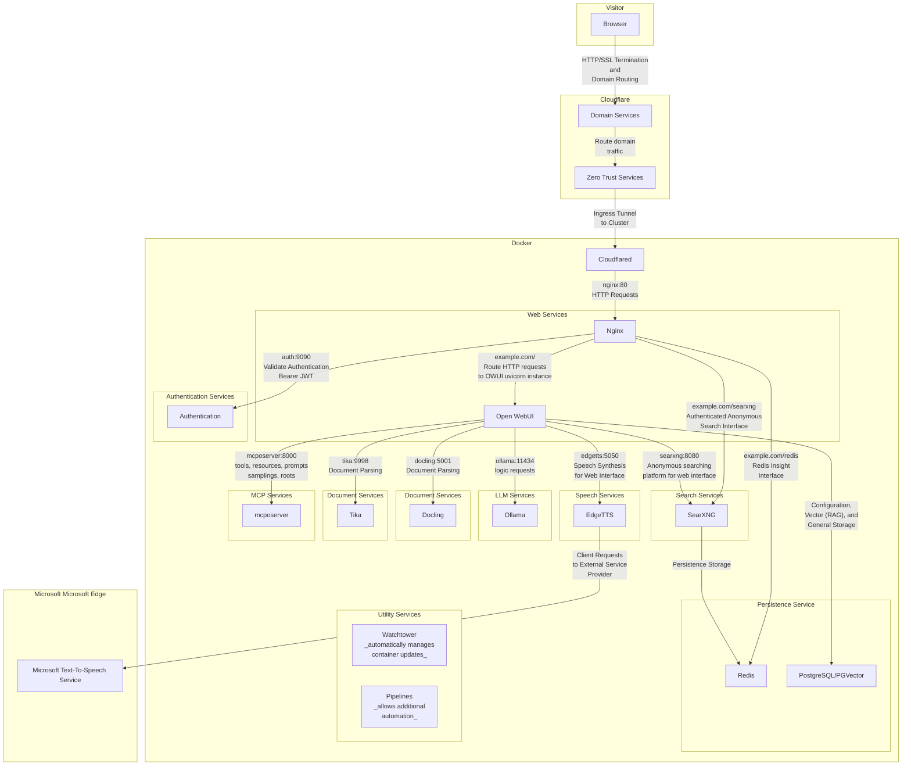

# Service Architecture

```mermaid
graph
    subgraph Visitor
        browser[Browser]
    end

    subgraph Cloudflare
        customdomain[Domain Services]
        zerotrusttunnel[Zero Trust Services]
    end

    %% Cloudflare
    browser -- 
        HTTP/SSL Termination
        and
        Domain Routing
    --> customdomain --
        Route domain
        traffic
    --> zerotrusttunnel

    subgraph Docker
        cloudflared[Cloudflared]

        zerotrusttunnel --
            Ingress Tunnel
            to Cluster
        --> cloudflared

        subgraph Web Services
            nginx[Nginx]
            openwebui[Open WebUI]
        end

        cloudflared -- "nginx:80"
            HTTP Requests
        --> nginx

        nginx -- "example.com/"
            Route HTTP requests
            to OWUI uvicorn instance
        --> openwebui

        nginx -- "example.com/redis"
            Redis Insight
            Interface
        --> redis

        nginx -- "example.com/searxng"
            Authenticated Anonymous
            Search Interface
        --> searxng

        subgraph Authentication Services
            auth[Authentication]
        end

        nginx -- "auth:9090"
            Validate Authentication
            Bearer JWT
        --> auth

        subgraph Speech Services
            edgetts[EdgeTTS]
        end

        openwebui -- "edgetts:5050"
            Speech Synthesis
            for Web Interface
        --> edgetts

        subgraph Search Services
            searxng[SearXNG]
        end

        openwebui -- "searxng:8080"
            Anonymous searching
            platform for web interface
        --> searxng

        subgraph LLM Services
            ollama[Ollama]
        end

        openwebui -- ""ollama:11434
            logic requests
        --> ollama

        subgraph Document Services
            docling[Docling]
        end

        openwebui -- "docling:5001"
            Document Parsing
        --> docling

        subgraph Document Services
            tika[Tika]
        end

        openwebui -- "tika:9998"
            Document Parsing
        --> tika

        subgraph MCP Services
            mcposerver[mcposerver]
        end

        openwebui -- "mcposerver:8000"
            tools, resources, prompts
            samplings, roots
        --> mcposerver

        subgraph Persistence Service
            db[PostgreSQL/PGVector]
            redis[Redis]
        end

        openwebui --
            Configuration,
            Vector (RAG), and
            General Storage
        --> db

        searxng --
            Persistence Storage
        --> redis

        subgraph Utility Services
            watchtower[Watchtower
                _automatically manages
                container updates_
            ]
            pipelines[Pipelines
                _allows additional
                automation_
            ]
        end
    end

    subgraph Microsoft Microsoft Edge
        microsofonlinesservice[Microsoft Text-To-Speech Service]
    end

    edgetts --
        Client Requests
        to External Service
        Provider
    --> microsofonlinesservice
```
