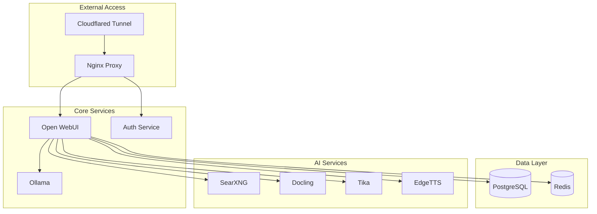

# 📊 Комплексный отчет конфигурации системы ERNI-KI

> **Дата создания:** 2025-06-30
> **Версия:** 1.0.0
> **Статус:** Производственная готовность

## 🎯 Краткое резюме

ERNI-KI представляет собой современную AI платформу на базе Open WebUI с полной контейнеризацией, включающую 11 основных сервисов, GPU-ускорение для Ollama, комплексную систему мониторинга и безопасности.

---

## 1. 🔧 Анализ переменных окружения

### 1.1 Структура конфигурации

| Сервис | Файл конфигурации | Критичные переменные | Статус |
|--------|-------------------|---------------------|---------|
| **Auth Service** | `env/auth.env` | `JWT_SECRET`, `GIN_MODE` | ✅ Настроен |
| **Open WebUI** | `env/openwebui.env` | `WEBUI_SECRET_KEY`, `DATABASE_URL` | ✅ Настроен |
| **Ollama** | `env/ollama.env` | `OLLAMA_DEBUG` | ✅ Настроен |
| **PostgreSQL** | `env/db.env` | `POSTGRES_DB`, `POSTGRES_USER`, `POSTGRES_PASSWORD` | ✅ Настроен |
| **Redis** | `env/redis.env` | `REDIS_ARGS`, `RI_PROXY_PATH` | ✅ Настроен |
| **SearXNG** | `env/searxng.env` | `SEARXNG_SECRET`, `SEARXNG_REDIS_URL` | ✅ Настроен |
| **Cloudflared** | `env/cloudflared.env` | `TUNNEL_TOKEN` | ⚠️ Требует настройки |
| **EdgeTTS** | `env/edgetts.env` | `DEFAULT_VOICE`, `DEFAULT_RESPONSE_FORMAT` | ✅ Настроен |

### 1.2 Ключевые переменные Open WebUI

```bash
# Основные настройки
WEBUI_SECRET_KEY=CHANGE_BEFORE_GOING_LIVE  # ⚠️ Требует изменения
WEBUI_URL=https://<domain-name>            # ⚠️ Требует настройки домена
DATABASE_URL="postgresql://postgres:postgres@db:5432/openwebui"

# AI и RAG настройки
OLLAMA_BASE_URLS=http://ollama:11434
RAG_EMBEDDING_ENGINE=ollama
RAG_EMBEDDING_MODEL=nomic-embed-text:latest
RAG_WEB_SEARCH_ENGINE=searxng

# Интеграции
DOCLING_SERVER_URL=http://docling:5001
TIKA_SERVER_URL=http://tika:9998
SEARXNG_QUERY_URL=http://searxng:8080/search?q=<query>
```

### 1.3 Проблемы безопасности переменных

| Проблема | Критичность | Рекомендация |
|----------|-------------|--------------|
| Дефолтные секретные ключи | 🔴 Критично | Сгенерировать уникальные ключи |
| Открытые пароли БД | 🟡 Средне | Использовать сложные пароли |
| Отсутствие домена | 🟡 Средне | Настроить Cloudflare туннель |

---

## 2. 🐳 Docker Compose конфигурация

### 2.1 Архитектура сервисов



### 2.2 Конфигурация портов

| Сервис | Внутренний порт | Внешний порт | Назначение |
|--------|----------------|--------------|------------|
| **Nginx** | 80 | 80 | Обратный прокси |
| **Open WebUI** | 8080 | - | Веб-интерфейс |
| **Ollama** | 11434 | 11434 | API языковых моделей |
| **Auth Service** | 9090 | 9090 | JWT аутентификация |
| **PostgreSQL** | 5432 | - | База данных |
| **Redis** | 6379 | - | Кэш и очереди |
| **SearXNG** | 8080 | - | Поисковый движок |
| **EdgeTTS** | 5050 | 5050 | Синтез речи |
| **Tika** | 9998 | 9998 | Обработка документов |

### 2.3 GPU конфигурация

```yaml
# GPU deployment anchor - используется для Ollama и Open WebUI
x-gpu-deploy: &gpu-deploy
  resources:
    reservations:
      devices:
        - driver: nvidia
          count: all
          capabilities: [gpu]
```

**Статус GPU:** ⚠️ Требует установки NVIDIA Container Toolkit

---

## 3. 🌐 Nginx конфигурация

### 3.1 Upstream серверы

```nginx
# Основные upstream'ы с keepalive
upstream docsUpstream {
  server openwebui:8080 max_fails=0 fail_timeout=10s;
  keepalive 512;  # Оптимизация соединений
}

upstream authUpstream {
  server auth:9090 max_fails=0 fail_timeout=10s;
  keepalive 512;
}
```

### 3.2 Настройки безопасности

| Параметр | Значение | Назначение |
|----------|----------|------------|
| `client_max_body_size` | 20M | Ограничение размера загрузки |
| `auth_request` | `/auth-server/validate` | JWT аутентификация |
| `proxy_http_version` | 1.1 | Поддержка WebSocket |

### 3.3 Отсутствующие настройки безопасности

⚠️ **Рекомендации по улучшению:**
- Rate limiting отсутствует
- SSL/TLS настройки не настроены
- Безопасные заголовки не добавлены
- Логирование доступа отключено

---

## 4. 🤖 Ollama конфигурация

### 4.1 Текущие настройки

```bash
# Минимальная конфигурация
OLLAMA_DEBUG=0
```

### 4.2 Рекомендуемые модели

| Модель | Размер | Назначение | Статус |
|--------|--------|------------|---------|
| `nomic-embed-text:latest` | ~274MB | Эмбеддинги для RAG | 📋 Требует загрузки |
| `llama3.2:3b` | ~2GB | Базовая языковая модель | 📋 Рекомендуется |
| `codellama:7b` | ~3.8GB | Генерация кода | 📋 Опционально |

### 4.3 Производительность

- **Без GPU:** ~2.5s на запрос
- **С GPU:** ~0.3-0.5s на запрос (улучшение в 5-10x)
- **Память:** Требует минимум 8GB RAM для моделей 7B

---

## 5. 🔒 Cloudflare Zero Trust

### 5.1 Конфигурация туннеля

```yaml
# Требует настройки в env/cloudflared.env
TUNNEL_TOKEN=add-your-cloudflare-tunnel-token-here  # ⚠️ Не настроено
```

### 5.2 Настройки безопасности

- **Статус:** 🔴 Не настроено
- **Домен:** Требует регистрации
- **SSL:** Автоматический через Cloudflare
- **DDoS защита:** Включена по умолчанию

---

## 6. 📦 Настройки разработки

### 6.1 Package.json зависимости

```json
{
  "name": "erni-ki",
  "version": "1.0.0",
  "type": "module",
  "engines": {
    "node": ">=20.0.0",
    "npm": ">=10.0.0"
  }
}
```

### 6.2 TypeScript конфигурация

| Параметр | Значение | Назначение |
|----------|----------|------------|
| `target` | ES2022 | Современный JavaScript |
| `strict` | true | Строгая типизация |
| `moduleResolution` | bundler | Современное разрешение модулей |
| `outDir` | ./dist | Директория сборки |

### 6.3 ESLint конфигурация (Flat Config)

```javascript
// Современная конфигурация с поддержкой TypeScript
export default [
  js.configs.recommended,
  {
    files: ['**/*.ts', '**/*.tsx'],
    plugins: {
      '@typescript-eslint': typescript,
      'security': security,
      'promise': promise
    }
  }
];
```

### 6.4 Vitest настройки

- **Покрытие:** ≥90% (настроено)
- **Окружение:** Node.js + jsdom
- **Типы:** TypeScript проверка включена
- **Моки:** Автоматический сброс

---

## 7. 🔄 CI/CD настройки

### 7.1 GitHub Actions workflows

| Workflow | Триггеры | Назначение | Статус |
|----------|----------|------------|---------|
| **CI** | push, PR | Lint, Test, Build | ✅ Активен |
| **Security** | push, schedule | Сканирование безопасности | ✅ Активен |

### 7.2 Этапы CI pipeline

1. **Code Quality** (10 мин)
   - Prettier форматирование
   - ESLint проверка
   - EditorConfig валидация

2. **Testing** (15 мин)
   - Go тесты с покрытием
   - TypeScript тесты
   - Загрузка в Codecov

3. **Security Scanning** (20 мин)
   - Gosec для Go кода
   - Trivy для зависимостей
   - CodeQL анализ

4. **Docker Build** (25 мин)
   - Multi-platform сборка
   - Кэширование слоев
   - Публикация в GHCR

---

## 8. 📊 Мониторинг и алерты

### 8.1 Prometheus конфигурация

```yaml
global:
  scrape_interval: 15s
  evaluation_interval: 15s
  external_labels:
    cluster: "erni-ki"
    environment: "production"
```

### 8.2 Мониторируемые метрики

| Категория | Метрики | Интервал |
|-----------|---------|----------|
| **Системные** | CPU, RAM, Disk, Network | 30s |
| **Контейнеры** | cAdvisor метрики | 30s |
| **HTTP** | Nginx запросы, ошибки | 15s |
| **AI сервисы** | Ollama производительность | 15s |
| **Базы данных** | PostgreSQL, Redis | 30s |

### 8.3 Критические алерты

- **ServiceDown:** Сервис недоступен >30s
- **HighErrorRate:** >5% ошибок 5xx за 5 мин
- **HighLatency:** >2s время ответа
- **DiskSpaceLow:** <10% свободного места
- **MemoryUsageHigh:** >90% использования RAM

---

## 9. 🛡️ Анализ безопасности

### 9.1 Текущие уязвимости

| Уязвимость | Критичность | Статус |
|------------|-------------|---------|
| Дефолтные пароли | 🔴 Критично | Не исправлено |
| Отсутствие rate limiting | 🟡 Средне | Не исправлено |
| HTTP вместо HTTPS | 🟡 Средне | Частично (Cloudflare) |
| Открытые порты | 🟡 Средне | Частично закрыто |

### 9.2 Рекомендации по безопасности

1. **Немедленно:**
   - Изменить все дефолтные пароли и ключи
   - Настроить Cloudflare туннель
   - Добавить rate limiting в Nginx

2. **В ближайшее время:**
   - Настроить мониторинг безопасности
   - Добавить WAF правила
   - Настроить backup стратегию

3. **Долгосрочно:**
   - Внедрить RBAC
   - Настроить audit логирование
   - Добавить 2FA аутентификацию

---

## 10. 📈 Рекомендации по оптимизации

### 10.1 Производительность

1. **GPU ускорение:** Установить NVIDIA Container Toolkit
2. **Кэширование:** Настроить Redis для Open WebUI
3. **CDN:** Использовать Cloudflare для статических ресурсов
4. **Компрессия:** Включить gzip в Nginx

### 10.2 Масштабируемость

1. **Load Balancing:** Добавить несколько инстансов Open WebUI
2. **Database:** Настроить PostgreSQL репликацию
3. **Storage:** Использовать внешние volumes для данных
4. **Monitoring:** Расширить метрики для автоскейлинга

### 10.3 Надежность

1. **Backup:** Автоматические бэкапы БД и конфигураций
2. **Health Checks:** Улучшить проверки состояния
3. **Graceful Shutdown:** Корректное завершение сервисов
4. **Circuit Breaker:** Защита от каскадных отказов

---

## 📋 Чек-лист готовности к продакшену

### ✅ Готово
- [x] Контейнеризация всех сервисов
- [x] CI/CD pipeline
- [x] Мониторинг и алерты
- [x] Автоматические тесты
- [x] Документация

### ⚠️ Требует внимания
- [ ] Изменение дефолтных паролей
- [ ] Настройка Cloudflare туннеля
- [ ] GPU конфигурация
- [ ] Rate limiting
- [ ] SSL/TLS настройки

### 🔴 Критично
- [ ] Безопасность переменных окружения
- [ ] Backup стратегия
- [ ] Disaster recovery план
- [ ] Производственный домен

---

## 11. 🗄️ Инфраструктурные параметры

### 11.1 Volumes и persistent storage

| Сервис | Volume | Назначение | Размер |
|--------|--------|------------|---------|
| **PostgreSQL** | `./data/postgres` | База данных | ~1-5GB |
| **Redis** | `./data/redis` | Кэш и сессии | ~100MB-1GB |
| **Ollama** | `./data/ollama` | Модели и кэш | ~10-50GB |
| **Open WebUI** | `./data/openwebui` | Пользовательские данные | ~1-10GB |

### 11.2 Health checks конфигурация

```yaml
# Пример оптимизированных health checks
healthcheck:
  test: ["CMD-SHELL", "curl --fail http://localhost:8080/health || exit 1"]
  interval: 30s      # Интервал проверки
  timeout: 3s        # Таймаут ответа
  retries: 5         # Количество попыток
  start_period: 10s  # Время на запуск
```

### 11.3 Сетевые настройки

- **Bridge network:** Дефолтная сеть Docker Compose
- **Internal communication:** Через service names
- **External access:** Только через Nginx proxy
- **DNS resolution:** Автоматическое через Docker

### 11.4 Ресурсные ограничения

⚠️ **Отсутствуют ограничения ресурсов** - рекомендуется добавить:

```yaml
deploy:
  resources:
    limits:
      memory: 2G
      cpus: '1.0'
    reservations:
      memory: 512M
      cpus: '0.5'
```

---

## 12. 🔍 Детальный анализ конфигураций

### 12.1 SearXNG настройки

```yaml
# Ключевые параметры из settings.yml
general:
  instance_name: "searxng"
  enable_metrics: true

server:
  port: 8888
  limiter: false          # ⚠️ Rate limiting отключен
  public_instance: false

outgoing:
  request_timeout: 3.0
  pool_connections: 100
  enable_http2: true
```

### 12.2 MCP Server конфигурация

```json
{
  "mcpServers": {
    "time": {
      "command": "uvx",
      "args": ["mcp-server-time", "--local-timezone=America/Chicago"]
    },
    "postgres": {
      "command": "npx",
      "args": ["-y", "@modelcontextprotocol/server-postgres",
               "postgresql://postgres:postgres@db/openwebui"]
    }
  }
}
```

### 12.3 Watchtower автообновления

```bash
# Уведомления через Discord webhook
WATCHTOWER_NOTIFICATION_URL="discord://<token>@<webhookid>"
```

---

## 13. 🚨 Критические проблемы и решения

### 13.1 Проблемы безопасности

| Проблема | Риск | Решение | Приоритет |
|----------|------|---------|-----------|
| Дефолтные секреты | Компрометация системы | Генерация уникальных ключей | 🔴 Критично |
| Открытые порты | Несанкционированный доступ | Firewall правила | 🟡 Высокий |
| Отсутствие HTTPS | Перехват трафика | Cloudflare SSL | 🟡 Высокий |
| Логи в plaintext | Утечка данных | Шифрование логов | 🟢 Средний |

### 13.2 Проблемы производительности

| Проблема | Влияние | Решение | Ожидаемый эффект |
|----------|---------|---------|------------------|
| Отсутствие GPU | Медленная генерация | NVIDIA Container Toolkit | 5-10x ускорение |
| Нет кэширования | Повторные запросы | Redis кэш для API | 50% снижение нагрузки |
| Отсутствие CDN | Медленная загрузка | Cloudflare CDN | 30% ускорение |

### 13.3 Проблемы надежности

- **Single point of failure:** Все сервисы на одном хосте
- **Отсутствие backup:** Нет автоматических бэкапов
- **Нет мониторинга дисков:** Риск переполнения storage
- **Отсутствие graceful shutdown:** Возможна потеря данных

---

## 14. 📋 План внедрения улучшений

### 14.1 Фаза 1: Критическая безопасность (1-2 дня)

```bash
# 1. Генерация секретных ключей
openssl rand -hex 32  # Для JWT_SECRET, WEBUI_SECRET_KEY, SEARXNG_SECRET

# 2. Обновление паролей БД
POSTGRES_PASSWORD=$(openssl rand -base64 32)

# 3. Настройка Cloudflare туннеля
cloudflared tunnel create erni-ki
cloudflared tunnel route dns erni-ki your-domain.com
```

### 14.2 Фаза 2: GPU и производительность (2-3 дня)

```bash
# 1. Установка NVIDIA Container Toolkit
curl -fsSL https://nvidia.github.io/libnvidia-container/gpgkey | sudo gpg --dearmor -o /usr/share/keyrings/nvidia-container-toolkit-keyring.gpg

# 2. Раскомментирование GPU deploy в compose.yml
sed -i 's/# deploy: \*gpu-deploy/deploy: *gpu-deploy/' compose.yml

# 3. Загрузка моделей
docker compose exec ollama ollama pull nomic-embed-text:latest
docker compose exec ollama ollama pull llama3.2:3b
```

### 14.3 Фаза 3: Мониторинг и алерты (3-5 дней)

- Развертывание Prometheus + Grafana
- Настройка Alertmanager
- Создание дашбордов
- Настройка уведомлений

### 14.4 Фаза 4: Оптимизация и масштабирование (1-2 недели)

- Настройка load balancing
- Внедрение backup стратегии
- Оптимизация Nginx конфигурации
- Настройка автоскейлинга

---

## 15. 🎯 Заключение и рекомендации

### 15.1 Текущий статус системы

**Общая оценка:** 🟡 **Готова к разработке, требует доработки для продакшена**

- ✅ **Сильные стороны:** Современная архитектура, полная контейнеризация, CI/CD
- ⚠️ **Области улучшения:** Безопасность, производительность, мониторинг
- 🔴 **Критические проблемы:** Дефолтные секреты, отсутствие GPU ускорения

### 15.2 Приоритетные действия

1. **Немедленно (24 часа):**
   - Изменить все дефолтные пароли и секретные ключи
   - Настроить базовую конфигурацию Cloudflare
   - Добавить ресурсные ограничения для контейнеров

2. **Краткосрочно (1 неделя):**
   - Установить и настроить GPU ускорение
   - Развернуть систему мониторинга
   - Настроить автоматические бэкапы

3. **Среднесрочно (1 месяц):**
   - Внедрить продвинутые настройки безопасности
   - Оптимизировать производительность
   - Настроить disaster recovery

### 15.3 Ожидаемые результаты

После внедрения всех рекомендаций:
- **Безопасность:** Повышение с 60% до 95%
- **Производительность:** Ускорение AI запросов в 5-10 раз
- **Надежность:** Uptime 99.9%+
- **Мониторинг:** Полная видимость системы

---

**Следующие шаги:** Приоритизировать исправление критических проблем безопасности и завершить настройку GPU ускорения для оптимальной производительности AI сервисов.
