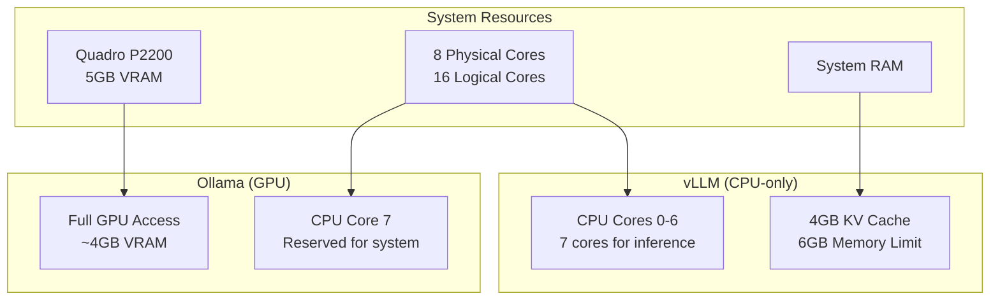

# vLLM Resource Optimization для ERNI-KI

## Обзор конфигурации

Данная конфигурация оптимизирована для совместного использования ресурсов между vLLM (CPU) и Ollama (GPU) на системе с Quadro P2200.

## Архитектура ресурсов



## Конфигурация CPU

### Thread Binding
- **vLLM**: Использует CPU ядра 0-6 (7 ядер)
- **System**: Резервирует CPU ядро 7 для системных процессов
- **Ollama**: Может использовать любые доступные CPU ядра

### Переменные окружения
```bash
VLLM_CPU_OMP_THREADS_BIND=0-6
VLLM_CPU_NUM_OF_RESERVED_CPU=1
VLLM_CPU_KVCACHE_SPACE=4
```

## Конфигурация памяти

### vLLM Memory Limits
- **Лимит памяти**: 6GB
- **Резерв памяти**: 2GB
- **KV Cache**: 4GB

### Оптимизация для CPU
- **Batch size**: 1024 tokens (оптимизировано для CPU)
- **Max sequences**: 64 (снижено для CPU)
- **Block size**: 16 (рекомендовано для CPU)

## Производительность

### Ожидаемые показатели
- **vLLM CPU**: 2-5 tokens/sec (зависит от модели)
- **Ollama GPU**: 15-30 tokens/sec (с GPU ускорением)
- **Совместная работа**: Без конфликтов ресурсов

### Мониторинг
```bash
# Проверка использования CPU
htop

# Проверка использования GPU
nvidia-smi

# Проверка памяти vLLM
docker stats vllm
```

## Рекомендации по использованию

### Когда использовать vLLM (CPU)
- Простые задачи генерации текста
- Batch обработка (офлайн)
- Когда Ollama занят GPU-интенсивными задачами

### Когда использовать Ollama (GPU)
- Интерактивные чаты
- Большие модели (>7B параметров)
- Задачи требующие низкой латентности

## Troubleshooting

### Проблема: vLLM не запускается
```bash
# Проверить переменные окружения
docker-compose exec vllm env | grep VLLM

# Проверить логи
docker-compose logs vllm --tail=50
```

### Проблема: Низкая производительность
```bash
# Проверить CPU binding
docker-compose exec vllm cat /proc/self/status | grep Cpus_allowed_list

# Оптимизировать KV cache
export VLLM_CPU_KVCACHE_SPACE=6
```

### Проблема: Конфликт с Ollama
```bash
# Убедиться что vLLM использует только CPU
docker-compose exec vllm nvidia-smi  # Должна выдать ошибку

# Проверить что Ollama имеет доступ к GPU
docker-compose exec ollama nvidia-smi
```

## Масштабирование

### Увеличение производительности vLLM
1. Увеличить `VLLM_CPU_KVCACHE_SPACE` до 6-8GB
2. Использовать больше CPU ядер (0-7)
3. Оптимизировать модель (квантизация)

### Балансировка нагрузки
- Использовать nginx для распределения запросов
- Настроить health checks для автоматического переключения
- Мониторить производительность обоих сервисов

## Безопасность

### Изоляция ресурсов
- vLLM изолирован от GPU через Docker
- CPU ядра разделены между сервисами
- Отдельные лимиты памяти для каждого сервиса

### Мониторинг ресурсов
- Автоматические алерты при превышении лимитов
- Логирование использования ресурсов
- Health checks для обоих сервисов
