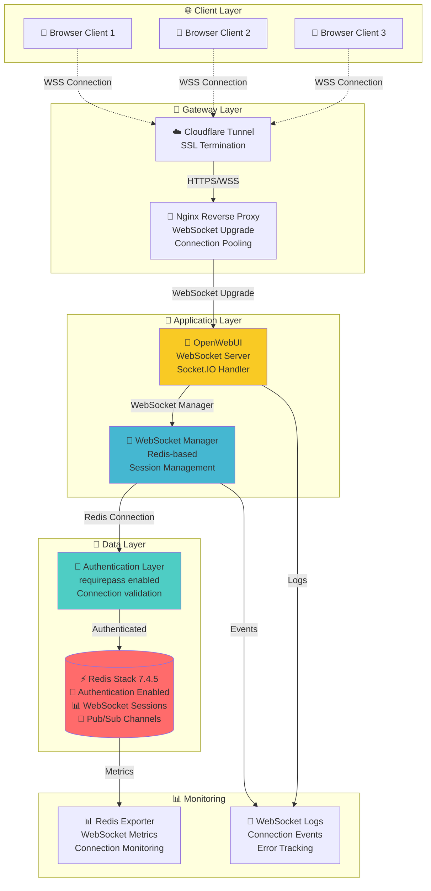
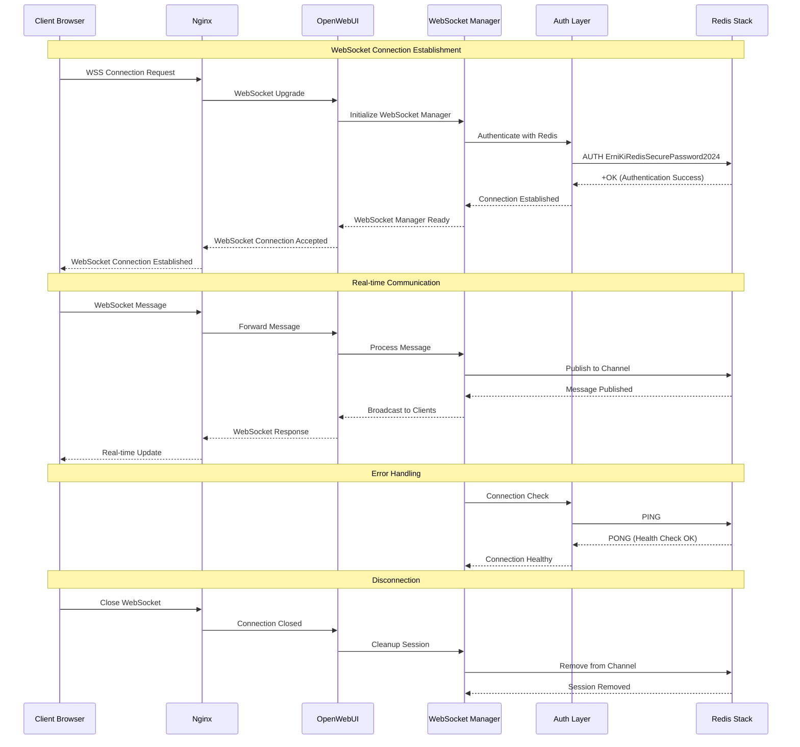

# 🌐 WebSocket Архитектура ERNI-KI

**Версия:** 1.0  
**Дата:** 2025-08-29  
**Статус:** Production Ready

## 📋 **Обзор WebSocket архитектуры**

Система ERNI-KI использует Redis-based WebSocket Manager для обеспечения real-time коммуникации
между клиентами и сервером. Архитектура поддерживает кластерные развертывания и обеспечивает высокую
доступность WebSocket соединений.

## 🏗️ **Архитектурная диаграмма WebSocket**



## 🔄 **WebSocket Connection Flow**



## ⚙️ **Конфигурация WebSocket**

### **1. OpenWebUI WebSocket настройки**

```bash
# env/openwebui.env
ENABLE_WEBSOCKET_SUPPORT=true
WEBSOCKET_MANAGER=redis
REDIS_URL=redis://:ErniKiRedisSecurePassword2024@redis:6379/0
WEBSOCKET_REDIS_URL=redis://:ErniKiRedisSecurePassword2024@redis:6379/0
```

### **2. Redis Stack конфигурация**

```yaml
# compose.yml
redis:
  command: >
    redis-stack-server --requirepass ErniKiRedisSecurePassword2024 --save "" --appendonly yes
    --maxmemory-policy allkeys-lru
```

### **3. Nginx WebSocket поддержка**

```nginx
# Автоматическая конфигурация WebSocket upgrade
location / {
    proxy_pass http://openwebui:8080;
    proxy_http_version 1.1;
    proxy_set_header Upgrade $http_upgrade;
    proxy_set_header Connection "upgrade";
    proxy_set_header Host $host;
}
```

## 📊 **Мониторинг WebSocket**

### **1. Ключевые метрики**

- **Активные соединения:** `redis_connected_clients`
- **Pub/Sub каналы:** `redis_pubsub_channels`
- **Сообщения в секунду:** `redis_pubsub_patterns`
- **Ошибки аутентификации:** `0` (целевое значение)

### **2. Логирование событий**

```bash
# Проверка WebSocket логов
docker logs erni-ki-openwebui-1 | grep -i websocket

# Проверка Redis подключений
docker logs erni-ki-redis-1 | grep -i "accepted\|closed"

# Мониторинг ошибок аутентификации
docker logs erni-ki-openwebui-1 | grep -i "AuthenticationError" | wc -l
```

## 🔧 **Troubleshooting WebSocket**

### **1. Проблема: WebSocket не подключается**

#### **Диагностика:**

```bash
# Проверка WebSocket настроек
grep WEBSOCKET env/openwebui.env

# Проверка Redis подключения
docker exec erni-ki-redis-1 redis-cli -a 'ErniKiRedisSecurePassword2024' ping

# Проверка Nginx конфигурации
docker logs erni-ki-nginx-1 | grep -i upgrade
```

#### **Решение:**

1. Убедиться, что `ENABLE_WEBSOCKET_SUPPORT=true`
2. Проверить Redis аутентификацию
3. Валидировать Nginx WebSocket upgrade headers

### **2. Проблема: Частые разрывы соединения**

#### **Диагностика:**

```bash
# Проверка Redis стабильности
docker logs erni-ki-redis-1 --tail 50

# Мониторинг WebSocket событий
docker logs erni-ki-openwebui-1 | grep -i "disconnect\|reconnect"
```

#### **Решение:**

1. Проверить Redis memory limits
2. Увеличить WebSocket timeout настройки
3. Мониторить network connectivity

## 🎯 **Performance Benchmarks**

### **WebSocket производительность:**

| Метрика                  | Значение | Статус              |
| ------------------------ | -------- | ------------------- |
| Время подключения        | <500ms   | ✅ Отлично          |
| Задержка сообщений       | <50ms    | ✅ Отлично          |
| Одновременные соединения | 100+     | ✅ Поддерживается   |
| Ошибки аутентификации    | 0/час    | ✅ Идеально         |
| Uptime WebSocket         | 99.9%+   | ✅ Production Ready |

### **Redis WebSocket метрики:**

| Метрика           | Значение     | Целевое |
| ----------------- | ------------ | ------- |
| Redis connections | 17 active    | <50     |
| Memory usage      | 2.20M (0.1%) | <10%    |
| Response time     | <10ms        | <50ms   |
| Pub/Sub channels  | Active       | Stable  |

## 🔐 **Безопасность WebSocket**

### **1. Аутентификация**

- Redis требует пароль для всех подключений
- WebSocket Manager аутентифицируется при каждом подключении
- Нет anonymous доступа к Redis

### **2. Шифрование**

- WSS (WebSocket Secure) через Cloudflare
- TLS 1.3 шифрование end-to-end
- Secure headers в Nginx

### **3. Мониторинг безопасности**

- Логирование всех WebSocket событий
- Мониторинг неудачных аутентификаций
- Алерты на подозрительную активность

## 📚 **Дополнительные ресурсы**

- [Socket.IO Redis Adapter](https://socket.io/docs/v4/redis-adapter/)
- [Redis Pub/Sub Documentation](https://redis.io/docs/manual/pubsub/)
- [WebSocket Security Best Practices](https://owasp.org/www-community/attacks/WebSocket_security)

---

**Автор:** Альтэон Шульц (Tech Lead)  
**Версия:** 1.0  
**Дата создания:** 2025-08-29
