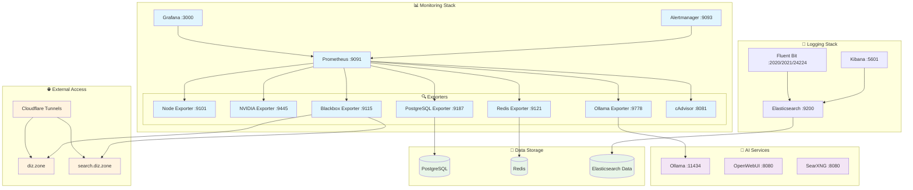
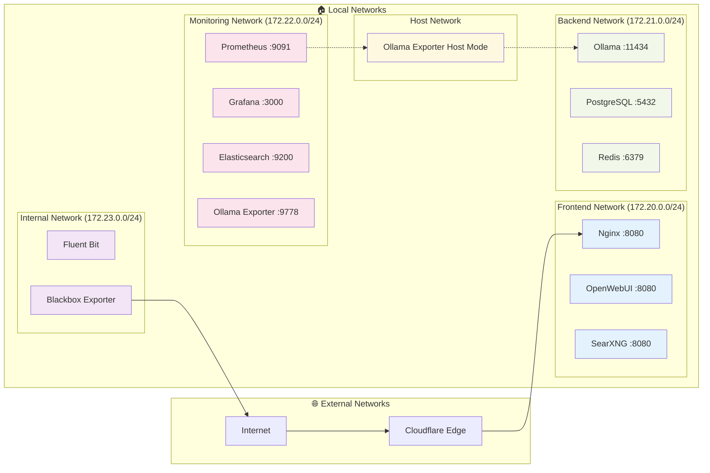
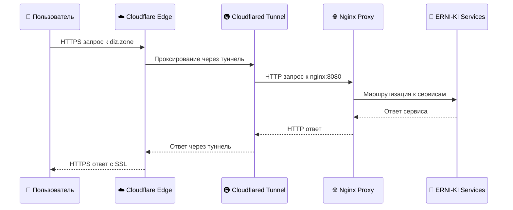
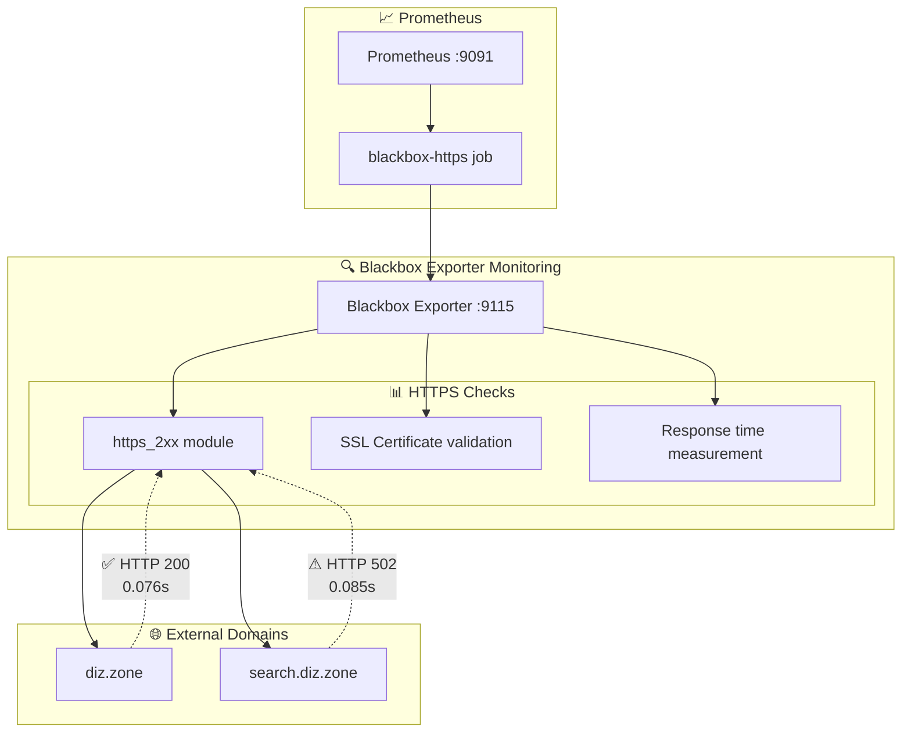
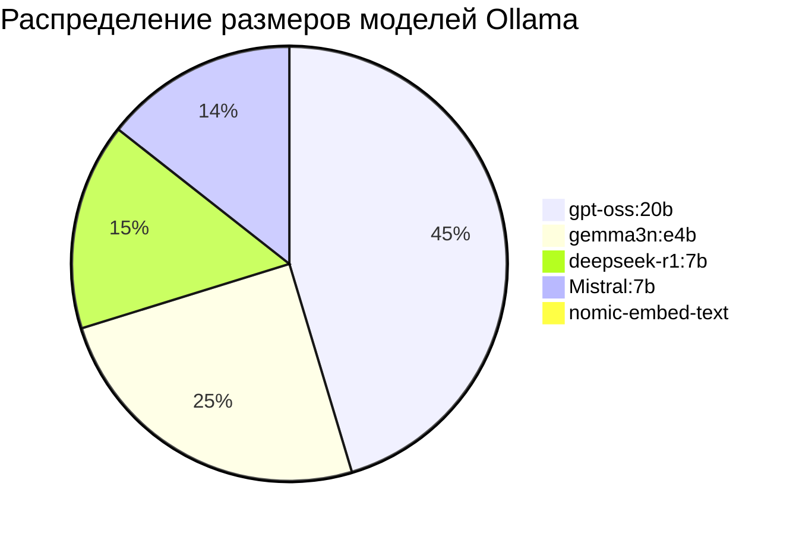
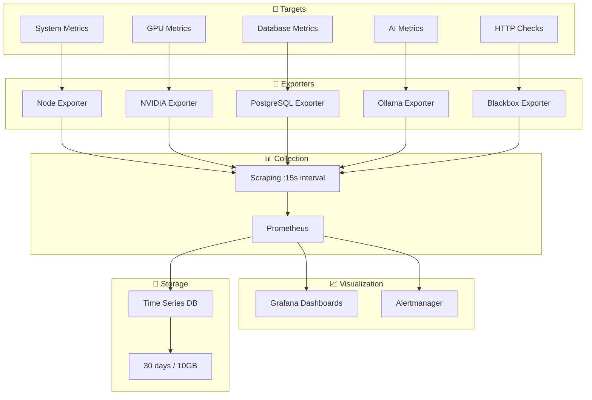
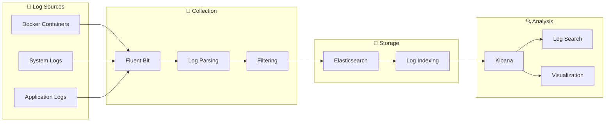

# 🏗️ Архитектурная документация системы мониторинга ERNI-KI

> **Детальное описание архитектуры, компонентов и интеграций системы мониторинга AI-инфраструктуры**

## 📋 Содержание

1. [Общая архитектура](#общая-архитектура)
2. [Компоненты системы](#компоненты-системы)
3. [Сетевая архитектура](#сетевая-архитектура)
4. [Интеграция с Cloudflare](#интеграция-с-cloudflare)
5. [AI-мониторинг](#ai-мониторинг)
6. [Потоки данных](#потоки-данных)

## 🎯 Общая архитектура

### Архитектурная диаграмма системы мониторинга



## 🔧 Компоненты системы

### Основные сервисы мониторинга

| Компонент | Версия | Порт | Назначение | Статус |
|-----------|--------|------|------------|--------|
| **Prometheus** | 2.48.0 | 9091 | Сбор и хранение метрик | 🟢 |
| **Grafana** | 10.2.0 | 3000 | Визуализация данных | 🟢 |
| **Alertmanager** | 0.25.0 | 9093 | Управление алертами | 🟢 |
| **Elasticsearch** | 7.17.15 | 9200 | Хранение логов | 🟢 |
| **Kibana** | 7.17.15 | 5601 | Анализ логов | 🟢 |
| **Fluent Bit** | 2.1.10 | 2020/2021/24224 | Сбор логов | 🟢 |

### Exporters и мониторинг агенты

| Exporter | Версия | Порт | Мониторируемый сервис | Статус |
|----------|--------|------|-----------------------|--------|
| **Node Exporter** | 1.6.1 | 9101 | Системные ресурсы | 🟢 |
| **NVIDIA Exporter** | 1.2.0 | 9445 | GPU метрики | 🟢 |
| **PostgreSQL Exporter** | 0.13.2 | 9187 | База данных | 🟢 |
| **Redis Exporter** | 1.55.0 | 9121 | Кэш Redis | 🟢 |
| **Ollama Exporter** | Custom | 9778 | **AI-сервисы** | 🟢 |
| **Blackbox Exporter** | 0.24.0 | 9115 | HTTP/HTTPS проверки | 🟢 |
| **cAdvisor** | 0.47.2 | 8081 | Контейнеры | 🟢 |

## 🌐 Сетевая архитектура

### Сетевая диаграмма



### Сетевые конфигурации

#### Основные сети Docker

```yaml
networks:
  # Основная сеть для внешнего доступа
  default:
    name: erni-ki-frontend
    driver: bridge
    ipam:
      config:
        - subnet: 172.20.0.0/24

  # Backend сеть для внутренних сервисов
  backend:
    name: erni-ki-backend
    driver: bridge
    ipam:
      config:
        - subnet: 172.21.0.0/24

  # Сеть мониторинга
  monitoring:
    name: erni-ki-monitoring
    driver: bridge
    ipam:
      config:
        - subnet: 172.22.0.0/24

  # Внутренняя сеть для высокопроизводительного взаимодействия
  internal:
    name: erni-ki-internal
    driver: bridge
    ipam:
      config:
        - subnet: 172.23.0.0/24
```

## ☁️ Интеграция с Cloudflare

### Архитектура Cloudflare туннелей



### Конфигурация доменов

| Домен | Статус | Назначение | Upstream |
|-------|--------|------------|----------|
| **diz.zone** | 🟢 Active | Основной интерфейс | nginx:8080 |
| **search.diz.zone** | 🟡 Issues | SearXNG поиск | searxng:8080 |
| **grafana.diz.zone** | ❌ Not configured | Мониторинг дашборды | grafana:3000 |

### HTTPS мониторинг



## 🤖 AI-мониторинг

### Ollama Exporter архитектура

```mermaid
graph TB
    subgraph "🤖 AI Services"
        OLLAMA[Ollama Service :11434]
        
        subgraph "📊 Ollama API Endpoints"
            API1[/api/version]
            API2[/api/tags]
            API3[/api/ps]
        end
    end

    subgraph "📡 Ollama Exporter :9778"
        EXPORTER[Python Exporter]
        
        subgraph "🔄 Metrics Collection"
            COLLECTOR1[Version Collector]
            COLLECTOR2[Models Collector]
            COLLECTOR3[Process Collector]
        end
        
        subgraph "📈 Prometheus Metrics"
            METRIC1[ollama_info]
            METRIC2[ollama_models_total]
            METRIC3[ollama_model_size_bytes]
            METRIC4[ollama_running_models]
            METRIC5[ollama_up]
        end
    end

    subgraph "📊 Prometheus"
        PROM[Prometheus :9091]
        JOB[ollama-exporter job]
    end

    %% Connections
    EXPORTER --> API1
    EXPORTER --> API2
    EXPORTER --> API3
    
    COLLECTOR1 --> METRIC1
    COLLECTOR2 --> METRIC2
    COLLECTOR2 --> METRIC3
    COLLECTOR3 --> METRIC4
    EXPORTER --> METRIC5
    
    PROM --> JOB
    JOB --> EXPORTER

    %% Current data
    METRIC1 -.->|"version=0.11.3"| PROM
    METRIC2 -.->|"5 models"| PROM
    METRIC3 -.->|"30.66GB total"| PROM
    METRIC4 -.->|"0 running"| PROM
    METRIC5 -.->|"1 (UP)"| PROM
```

### AI-метрики детализация

#### Текущие модели в системе



## 📊 Потоки данных

### Поток метрик



### Поток логов



## 🔧 Конфигурационные особенности

### Elasticsearch Single-Node оптимизация

```yaml
# Ключевые настройки для single-node кластера
environment:
  - discovery.type=single-node          # Отключает кластерный режим
  - xpack.security.enabled=false        # Упрощает конфигурацию
  - "ES_JAVA_OPTS=-Xms2g -Xmx2g"       # Оптимизированный heap
  
# Шаблон для новых индексов без реплик
PUT _template/no_replicas
{
  "index_patterns": ["*"],
  "settings": {
    "number_of_replicas": 0             # Без реплик для single-node
  }
}
```

### Ollama Exporter конфигурация

```python
# Сетевая конфигурация для доступа к Ollama
network_mode: host                      # Использует host network
environment:
  - OLLAMA_URL=http://localhost:11434   # Прямой доступ к Ollama

# Метрики обновляются каждые 30 секунд
scrape_interval: 30s
metrics_path: /metrics
```

## 📋 Статус компонентов

### Текущее состояние системы

| Категория | Компонент | Статус | Примечания |
|-----------|-----------|--------|------------|
| **Core** | Prometheus | 🟢 | 23/37 targets UP |
| **Core** | Grafana | 🟢 | Все дашборды работают |
| **Core** | Alertmanager | 🟢 | 0 активных алертов |
| **Logs** | Elasticsearch | 🟢 | GREEN status, 0 unassigned shards |
| **Logs** | Kibana | 🟢 | Подключен к ES |
| **Logs** | Fluent Bit | 🟢 | Собирает логи |
| **AI** | Ollama Exporter | 🟢 | 5 моделей, 30.66GB |
| **Network** | Blackbox Exporter | 🟢 | HTTPS мониторинг активен |
| **External** | diz.zone | 🟢 | HTTP 200, 0.076s |
| **External** | search.diz.zone | 🟡 | HTTP 502, требует исправления |

---

*Архитектурная документация обновлена: 2025-08-07*  
*Версия системы мониторинга: 2.1.0*
